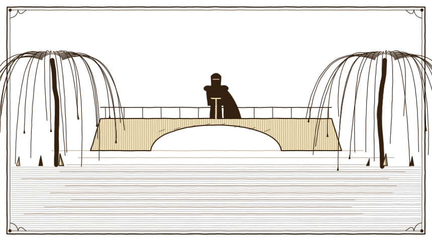

# Act II: build spec

*The Weeping Bridge. What the second slice of the campaign contains. Everything here comes from the lore (docs/lore.md); what this spec added to the lore is listed under* New to the lore *at the end, and is now in the lore too.*

> **Decided (3 October 2026). Nothing here is built yet.** It picks up where Act I ends (Nan turning the black lace over in her hands) and follows the lore's Act II: Wren, the hollow oak, the Weepwood, the Weeping Bridge and Sir Garrick. Levels 7 to 11 take nearly twice the experience that levels 1 to 7 did, so this act is about twice as long as Act I: twice the quests, about twice the creatures, and four forest regions instead of one. The choices made before building are under *Decided*.

---

## The act in one paragraph

Wren Ashdown comes home to the mill, furious: old Aldric found her brother's cloak at the Weeping Bridge seven years ago and never said a word. She makes the heroes take her to him (Act II, levels 7–11, ring 2). Aldric sends her to the hollow oak on the lakeshore, where Marcian and the princess left each other feathers and notes, and where somebody has just left a new one. Wren leads the heroes up the Lisle under the thorn wall into the Weepwood, the old King's forest gone black. In its middle the charcoal-burners of **Kilnholt** are still alive, inside a ring of kilns they keep burning all night, and when the heroes help them hold it, the kiln-master gives Wren what her brother left with him on his last round: his Warden badge and his logbook. With it they follow the marks Marcian cut into the trees, through the King's hunting Chase, past the Gallows Willow and an old barrow that has woken, to the Wardens' lodge on the Lisle, a ford held by dead guards, and the grave-mist. At the end of the trail a knight in rusted royal armour stands on the Weeping Bridge and lets no one cross. When he falls he tells them everything: the letter, the roots, his own sword, the King watching from his horse, and seven years outside a locked door. He gives them Marcian's bone whistle and asks them to tell her he is sorry. Wren goes home to tell her mother. About three to four hours of play.

**What the players believe by the end:** the wizard is a murderer too, and the queen is his victim twice over.

**Out of this act:** the Blightfields, the Barrow Fens and Old Tull, the Root Tower, the Kitchen Girl, cornering the Unsent, the Greyfang Hills and Ashford (Act III and later). The roads north of the bridge and east out of the Chase stay closed.

---

## How it plays, start to finish

1. **Wren comes home.** Act I is over and Maud knows about the bridge (*The Lamp in the Window*). Her daughter Wren is at the mill with a bow on her back, angry at everyone, and angriest at Aldric. She makes the heroes take her to him. (If you skipped Maud's quest, Nan sends you to Maud first: it is the way into Act II.)
2. **Wren and the Warden.** At his camp in the Greenmarch, Wren has it out with Aldric. He tells her where the Weeping Bridge is, says Marcian used to sit at the hollow oak that last year, and gives the heroes his bone whistle.
3. **The hollow oak.** A crow lifts off the oak as you come near and flies north. Inside the hollow, wrapped in a Warden's oilskin: Marcian's feather key, two notes signed *V.*, and on top of them a fresh black crow feather. Wren reads it with the key: *I'm coming.*
4. **Through the thorns.** Back in Millbrook, Wren takes the heroes up the Lisle where it runs under the thorn wall, and into the Weepwood. Her camp is cold; the heroes light her fire again.
5. **Kilnholt.** Smoke above the trees leads to the charcoal-burners' hamlet, a dozen huts inside a ring of smouldering kilns. They won't open the ring to strangers after dusk, until the dead come for the kilns and the heroes help hold them till morning.
6. **Marcian's last round.** In the morning the kiln-master, Hesketh Coll, gives Wren her brother's Warden badge and logbook, left with him seven years ago *"in case"*. The last entry is about a letter. Kilnholt's saw clears the fallen thorn-willow off the road north.
7. **The Warden's trail.** The logbook names the marks Marcian cut into the trees on his round. Wren reads them with his key (goose: onward; jay: danger; owl: shelter; heron: the crossing), from her camp, past the spider dell, up the old road, to Heron Lodge, the Wardens' old waystation.
8. **The lantern.** On the first night in the wood a grey lantern moves between the willows, going north. It stops, as if whoever carries it has turned to look, and goes out. Where it stood: grey dust and a dead moth.
9. **The ford.** Below the lodge, dead guards in rusted Thornhallow livery hold the old ford, searching the road for someone who ran away seven years ago. Past them are Marcian's last two marks; the second points into the mist, and with it the way opens.
10. **The side roads**, all through the act. The King's Chase, with its roofless hunting lodge, kennels gnawed open from inside, the Gallows Willow and a camp of goblin outriders. The Lisle Barrow and the old dead under it. A widow following the lights. The spider dell's Brood Mother. Bonespine, the old wolf. Diary pages caught on the thorns. Two more of the grey postman's letters. Errands between Millbrook and Kilnholt that make the traders better.
11. **The deep wood.** Beyond the mist it is dusk all day and the dead don't wait for night. A search party walks the old road, and mourners keen at the standing stones.
12. **The Weeping Bridge.** *"Halt. No one crosses. By order of the King."* Sir Garrick. The fight, and the whistle that stops him dead.
13. **The confession.** He kneels and tells them everything. Marcian's whistle, a second scrap of black lace, and Wren's arrow.
14. **The lamp.** Home to Maud. Act II ends.

---

## Regions

Four new outdoor regions (the wood, in four parts) and two interiors, plus new things in the Greenmarch and Millbrook.

*"The willows' bark has gone black and their branches end in thorns; long spikes of pale bone grow up between the roots; the light comes down green and dim through grave-mist; the river runs dark."* That is ring 2 everywhere in this act, getting worse the further north you go: the south edge of the Weepwood is still half green, Heron Reach is darker, and the deep wood around the bridge is dusk all day. Night comes earlier in all of them than in Millbrook.

The Weepwood was **the old King's forest**. His foresters kept it, he hunted in its eastern half (the King's Chase), and anyone caught taking his deer was hanged. Since the Wardens were disbanded and the King fell ill, nobody has kept it at all.

```
                         THE WEEPING BRIDGE (the deep wood)
                                       |
                                 (grave-mist)
                                       |
          THE LISLE BARROW ------ HERON REACH (Heron Lodge, the ford)
                                       |
                           (fallen thorn-willow)
                                       |
                                THE WEEPWOOD  ------------  THE KING'S CHASE ----x (east: goblin wall)
                         (Wren's camp, Kilnholt)            (hunting lodge, gallows)
                                       |
                        (river path under the thorns)
                                       |
                                   MILLBROOK
```

### 1. The Weepwood (ring 2, levels 7–8)

About 80 × 64 tiles. The south of the wood, where the Lisle comes down to Millbrook.

```
 . . . (north: the old road to Heron Reach; a fallen thorn-willow across it) . . .
 .   KEENING HOLLOW           ~~~~|                                            .
 .   (unmarked graves;          ~~~~   old road                                 .
 .    lights, mourners)          ~~~~    |        KILNHOLT                      .
 .                                ~~~~   |   (huts inside a ring of             .
 .   SPIDER DELL                   ~~~~  |    smoking kilns)       -> east: the .
 .   (webbed willows, egg          ~~~~  |                            King's    .
 .    sacs, the Brood Mother)      ~~~~  |      deer, boar, wolves     Chase    .
 .        black willows          ~~~~    |                                      .
 .   WREN'S CAMP  ~~~~~~~~~~~~~~~~~~     |      (edge of the wood:              .
 .   (lean-to, fire)    the Lisle        |       willows still half green)      .
 . . (river path under the thorns, to Millbrook) . . (thorn wall: the old road) . .
```

- **Wren's camp** (south-west, on the riverbank): a lean-to of willow poles, a drying rack, a ring of stones where her fire was. Once lit again it is a safe place, and where you wake if you fall in the Weepwood.
- **The edge of the wood** (south and east): willows still half green, deer and boar in the glades, wolves.
- **Kilnholt** (east of the old road): the charcoal-burners' hamlet (see below).
- **The spider dell** (west, across the river): a hollow of willows sheeted in web, egg sacs, cocoons (one holds a dead traveller's pack). Its queen, the Brood Mother, hangs in the dark at the back. Marcian marked the dell with a jay: *go round*.
- **The Keening Hollow** (north-west): a sunken glade of unmarked graves, travellers the wood took over the years, buried where they fell. Mourning Lights drift along the river toward it at night, and mourners keen over the graves.
- **Black willows** can be chopped for **black willow** wood: hard as horn and cold to the touch. The half-green willows at the edge of the wood still give logs, for fires.
- **Exits:**
  - south-west, the river path back to Millbrook (open);
  - south, the old road: the thorn wall from the wrong side. *"The thorns that close Millbrook's north road. Wren's river path, to the west, goes under them."*;
  - east, the King's Chase (open);
  - north, the old road to Heron Reach: *"A black willow has come down across the road, thorns as long as swords. Fire won't take it and an axe bounces off. The charcoal-burners at Kilnholt have a two-man saw. (Help Kilnholt, and they'll clear it.)"* Opens with *The Last Round*.

### Kilnholt, the charcoal-burners' hamlet

A clearing of a dozen turf-roofed huts, a sawpit, a long table under a lean-to, and around all of it a ring of eight earth kilns, smouldering day and night. The burners have made charcoal in the King's wood for generations, by licence and for a tithe. Since the bells they have kept every kiln burning through every night, and it has kept them alive: the thorns won't grow inside the ring, and the dead won't cross it. Except their own dead. The burners who died in the first nights come back every night, black with soot, to lie down on the kilns and put them out. Each night the ring is a little thinner.

Marcian walked through Kilnholt every week on his Warden's round. He ate at Mother Dunn's table, the children made him sing (the ducks on the millpond left), and he cut down a hanged man at the Gallows Willow once and buried him, which the foresters never forgave. On his last round he left his badge and his logbook with the kiln-master, *"in case"*.

### 2. The King's Chase (ring 2, levels 8–10)

About 72 × 60 tiles, east of the Weepwood. The old King's hunting forest: wider glades, older oaks gone black, and the remains of royal order everywhere (boundary stones with the crown cut on them, a ride cut straight through the trees for horses).

```
 . . . . . . . . . . . . . . . . . . . . . . . . . . . . . . . . . . . . . . . .
 .   BONESPINE'S ROCKS               deer glades           GOBLIN OUTRIDERS     .
 .   (the old wolf's den)                                  (hide tents,         .
 .                      THE KING'S HUNTING LODGE            wolf pens)          .
 .  <- west:            (roofless; the kennels                     -> east:    .
 .  the Weepwood         behind it, gnawed open                   the goblin   .
 .                       from the inside)                          wall         .
 .  ======= the King's Ride (straight through the trees) =======               .
 .     THE GALLOWS WILLOW           thornback wolves, boar                      .
 .     (the hanged, at night)                                                    .
 . . . . . . . . . . . . . . . . . . . . . . . . . . . . . . . . . . . . . . . .
```

- **The King's hunting lodge** (centre): a long timber lodge, its roof fallen in, antlers still over the door. On the table inside, the game book. Behind it, **the kennels**: every pen empty, every door gnawed open from the inside.
- **The Gallows Willow** (south-west): a huge black willow by the Ride where the King's foresters hanged poachers. At night the hanged drop down from the ropes, still holding their bows.
- **The deer glades** (north): deer and boar; good hunting, and Wren's favourite poaching ground.
- **Bonespine's rocks** (north-west): a tumble of boulders, the old wolf's den.
- **The goblin outriders' camp** (east): hide tents, wolf pens, stolen things. Greyfang goblins who fled their own hills.
- **Exits:**
  - west, the Weepwood;
  - east, the hill path to the Greyfang Hills: *"A wall of thornwood and bones, goblin-built, closes the hill path east. The spikes point outward, toward the hills. Whatever the goblins built it against, it's on the other side. (Act III.)"*

### 3. Heron Reach (ring 2, levels 9–10)

About 76 × 64 tiles, north of the Weepwood. The reach of the Lisle the Wardens kept: darker, the bone spikes standing taller, the river wide and slow and black.

```
 . . . . . . . . (north: grave-mist; the deep wood and the bridge beyond) . . . . . .
 .                       ~~~~~~           THE LISLE BARROW                        .
 .   Warden cache          ~~~~~~         (the mound; its door stone              .
 .                           ~~~~~~        pushed out from inside)                .
 .      HERON LODGE ======= THE FORD =====  (Tower Guard outpost)                 .
 .      (the Wardens'           ~~~~~~                       Warden cache          .
 .       waystation)          ~~~~~~        thornback wolves, bone spikes         .
 .                          ~~~~~~                                                .
 .   Warden cache         ~~~~~~   the Lisle                                      .
 . . . . . . . . (south: the old road back to the Weepwood) . . . . . . . . . . . . .
```

- **Heron Lodge** (west of the ford): the Wardens' waystation on the Lisle, stone below and timber above, a heron carved over the door. Its hearth has been cold since the Wardens were disbanded. A door leads inside.
- **The ford:** where the old road crosses the Lisle. Tower Guard hold it, with an outpost of shields and a cold brazier on the far bank.
- **The Lisle Barrow** (north-east): an old burial mound, far older than Corvalis. The Wardens of the Lisle kept a fire at its door every night, *so they may sleep*. The door stone lies cracked on the grass, pushed out from inside.
- **Three Warden caches**, hidden where Marcian's logbook says, each under an owl mark.
- **Mourning Lights** along the river at night; thornback wolves in the bone-spike thickets.
- **Exits:**
  - south, the old road back to the Weepwood;
  - north, the grave-mist: *"Grave-mist stands across the road like a wall. Walk into it and you come out where you went in. Without a trail to follow, nobody gets through. (Follow the Warden marks.)"* It opens with the last of Marcian's marks;
  - the doors of Heron Lodge and the Lisle Barrow.

### 4. The Weeping Bridge (ring 2, the deep wood, levels 10–11)

About 60 × 54 tiles. The heart of the Weepwood, through the mist. Under the mist it is **dusk all day**, so the dead walk here by day as well as by night (a taste of ring 3). The bone spikes stand thick as fences and the Lisle runs in a steep black cut.

<figure class="plate"><figcaption><b>Plate X.</b> The Weeping Bridge, and the knight who will not leave it.</figcaption></figure>

```
 . . . . . (north road to the Blightfields: black vines; closed) . . . . . .
 .     north bank: Garrick's cold watch-fire, a guard's lean-to             .
 .  great black willow ~~~~ [ THE WEEPING BRIDGE ] ~~~~ great black willow  .
 .  ~~~~~~~~~~~~~~~~~~~ the Lisle, in a steep cut ~~~~~~~~~~~~~~~~~~~~~      .
 .           the south landing (the arena)  +  the King's post              .
 .  MOURNERS' STONES          |                      thorns by the road     .
 .  (mourners keen here)   old road                  (a diary page)         .
 .       bone spikes          |   the search party                          .
 .  mist           mist       |          mist                mist          .
 . . . . . . . . . (south: back through the mist to Heron Reach) . . . . . .
```

- **The deep wood** (the south half): the old road winding north between bone spikes. A search party of Tower Guard walks it, day and night.
- **The mourners' stones** (west): a ring of old standing stones where mourners keen.
- **The Weeping Bridge** (centre-north): an old stone bridge, wide enough for a cart, between two great black willows that weep over its ends. The **south landing** is the boss arena. A proclamation is nailed to **the King's post** at the south end.
- **The north bank:** Garrick's cold watch-fire and a guard's lean-to.
- **Exits:**
  - south, back through the mist to Heron Reach;
  - north, the road to the Blightfields: *"Past the bridge, black vines as thick as a man choke the road north, and they move when you look away. Fire only makes them angry. (Act III.)"*

### 5. Heron Lodge (interior)

About 16 × 14 tiles, entered by the lodge door.

- **The hearth**, cold. Relight it for *Keep the Fire*.
- **The roll:** the beam over the hearth, carved with the names of the Wardens of the Lisle.
- **Bunks**, a **weapon rack** and a **Warden's chest**.
- Outside, at night, the grey postman leaves a letter on the step.

### 6. The Lisle Barrow (interior, levels 10–11)

About 30 × 40 tiles: the barrow's long stone passage, side chambers with the dead in their niches, and at the end a round hall where an old chieftain sits on a stone seat, his antlered helm on his knees. The dead here are older than Corvalis: the restless dead of the valley that the founding songs say were sung to sleep five hundred years ago. They are not the queen's in the way her captains are; the crown woke them along with everyone else.

### Changes to the Greenmarch and Millbrook

- **Greenmarch:** Wren waits at Aldric's camp, then at the hollow oak. The oak's hollow becomes something you can search. Crows on the oak and along the north shore.
- **Millbrook:** Wren at the mill (the start and the end of the act) and by the river at the thorn wall. Bess Tanner's cottage. A new way out: **the river path**, where the Lisle runs under the thorn wall (north-west), opened by Wren. The old north road stays closed, and its message changes: *"Black thorns as thick as your arm close the north road. Wren's river path, to the west, goes under them."* At night, a letter on the mill's doorstep. Tobin and Bram sell more once their errands are done.

---

## People

| Name | Where | Who they are | What they do in this act |
|---|---|---|---|
| **Wren Ashdown** *(new)* | Millbrook, the mill; the Greenmarch; then at your side in the wood | Marcian's sister, a huntress of seventeen | The main quests; reads the feather-code; walks and shoots with you; three side quests of her own |
| **Hesketh Coll** *(new)* | Kilnholt | The kiln-master, sixty, slow-spoken, smoke in every line of his face | The kilns; Marcian's badge and logbook; *The Barrow Watch*; sells charcoal |
| **Ada Coll** *(new)* | Kilnholt, the sawpit | Hesketh's daughter, a woodcutter with an axe over her shoulder and no patience | Saws the thorn-willow off the road; *The Brood Mother* |
| **Grandad Pell** *(new)* | Kilnholt, by the long table | An old poacher, eighty if he's a day | *The Gallows Willow*: the King's foresters hanged his brother there |
| **Mother Dunn** *(new)* | Kilnholt, the cookfire | Feeds everyone; fed Marcian every week | *Deer for the Pot*; sells food and bandages (pies, once Maud's flour comes) |
| **Warden Aldric** | Greenmarch, his camp | The last Warden | Faces Wren; sends you to the oak; gives his bone whistle; *Keep the Fire*; new things to ask about |
| **Nan Merrow** | Millbrook, her cottage | Victoria's old nurse | Diary pages 4–7; the grey postman's next letters; the King's game book; explains the clues away |
| **Maud Ashdown** | Millbrook, the mill | Marcian and Wren's mother | *Flour for Kilnholt*; the end of the act |
| **Father Odo** | Millbrook, the chapel | The village priest | *The Light in the Willows*; tells what mourners are |
| **Sergeant Pike** | Millbrook, the square | The Steward's herald | *Wolves on the Road*, *The Outriders*; one unwise remark about forged letters |
| **Tobin** | Millbrook, his stall | Peddler | *Silk for Ashford*; then sells a silk-strung bow and smoked venison |
| **Bram** | Millbrook, the smithy | Blacksmith | *Steel for Millbrook*; then sells steel |
| **Bess Tanner** *(new)* | Millbrook, her cottage; the Keening Hollow at night | A widow whose son Davy drowned in the Lisle last spring, before the bells | Follows the lights into the wood every night, sure they are his lantern |
| **Sir Garrick Thorne** *(new boss)* | The Weeping Bridge | The Queen's Jailer | The boss; afterwards a ghost who stays on the bridge |
| **The grey lantern** | The Weepwood, once | (The Grey Moth. Nobody knows that yet.) | Seen once, far off between the trees, going north |
| **The grey postman** (the Unsent) | Millbrook lanes and the old road, at night | Not a person any more | Two more letters, each left at the wrong door. Still can't be fought. |

### Wren

*Seventeen. Short temper, long bow, and her brother's laugh, which she hasn't used in years.* She talks in short sentences, swears at the wood, calls her mother Mam, and never says *my lady* to anyone. She was ten when Marcian vanished, and she has been looking for him in the woods ever since, without knowing where to look. She has also been poaching the King's deer since she was eleven, and would like you not to mention it.

- **Her anger** is at Aldric (who knew), at the King (dead, so out of reach), and at the wizard, who she is sure had something to do with it. *"When I find Potatoe Face I'm going to put an arrow in him. Just the one. I want him to see it coming."* Her hate is righteous, and easy to cheer.
- **Her hope** comes from the crow feather in the oak. For most of the act she half believes her brother is alive, or that his ghost is leaving her messages. The logbook makes it worse: he *was* going away.
- **The princess** means nothing to her at first. After the notes in the oak: *"She loved him. Good. Somebody should have, besides Mam and me."* After the bridge: *"Seven years with that knight outside her door. We're getting her out. For him."* (This is the promise the twist will break.)

**Wren walks with you.** From *Through the Thorns* to the bridge she follows the heroes through all four parts of the wood and the barrow, and shoots what they fight, with an archer's arrows a little weaker than a hero's. She can't die: badly hurt, she drops to one knee, swears, and is up again ten seconds later. She calls out what she sees (*"Spider. Up. UP."*, *"Don't follow the lights."*, *"That's one of his marks."*). When the heroes leave the wood she waits at her camp. In co-op she follows whichever hero is nearest.

### Kilnholt's people

- **Hesketh Coll** speaks as if every word costs charcoal. He kept Marcian's things for seven years because he didn't know where Aldric's camp was, the Wardens were gone, and the riders had said the boy ran south. *"He'd told me he was going away. So when they said he'd run, I thought, well. He said he was going."*
- **Ada Coll** lost three cutters to the spider dell this spring and wants it burned out. She calls the heroes *"lake folk"* and Wren *"the poacher"*, and Wren calls her *"the axe"*.
- **Grandad Pell** has hated the King's foresters for sixty years. *"The old King hanged my brother Tam for a deer. Now the King's own dogs run dead in the fields. I'd call that fair, if it weren't Millbrook's sheep they're eating."*
- **Mother Dunn** remembers Marcian at her table: *"Too thin, always. Ate like a wolf and sang like a gate. The children loved him."*

---

## Quests

★ marks the main story. XP numbers are a first pass, to be tuned in play (see *Pacing*).

### The way in (Millbrook and the Greenmarch, level 7)

| Quest | From | Goals | Reward |
|---|---|---|---|
| ★ **Seven Years Silent** | Wren | Take Wren to Aldric's camp; hear him out | Aldric's bone whistle, 50 XP |
| ★ **Feathers in the Oak** | Wren | Search the hollow oak on the west shore; read Marcian's key; show Wren the new feather | The notes from the oak (journal), 60 XP |
| Keep the Fire | Aldric (after *Seven Years Silent*) | Find Heron Lodge on the Lisle; relight its hearth (3 logs); read the roll of names; tell Aldric | Warden's cloak, a Warden's blade (or a Warden's longbow, for archers), 60 XP |

### The Weepwood and Kilnholt (levels 7–8)

| Quest | From | Goals | Reward |
|---|---|---|---|
| ★ **Through the Thorns** | Wren | Meet Wren by the river at the thorn wall; follow her into the Weepwood; build a fire at her camp | Smoked venison ×3, 60 XP |
| ★ **The Ring of Kilns** | Hesketh | Find Kilnholt; hold the kilns through one night (at least five of eight still burning at dawn) | Bandages ×4, 40 gold, 90 XP |
| ★ **The Last Round** | Hesketh | Hear Hesketh out; read Marcian's logbook; Ada saws through the fallen willow | Marcian's logbook (journal), 50 XP; the road north opens |
| The Brood Mother | Ada | Burn 6 egg sacs in the spider dell; slay the Brood Mother | Broodsilk leggings, 70 XP |
| Deer for the Pot | Mother Dunn | Bring 6 venison | Mother Dunn's pie ×3, 30 XP |
| The Light in the Willows | Father Odo | At night, find Bess Tanner in the Keening Hollow; put out the lights around her; tell Odo | 30 gold, bandages, 60 XP |
| Flour for Kilnholt | Maud (once Kilnholt is found) | Carry Maud's flour sacks to Mother Dunn | 30 XP; Mother Dunn starts baking pies |
| Steel for Millbrook | Bram (once Kilnholt is found) | Bring Bram 10 charcoal from Kilnholt | 40 XP; Bram sells steel, and the steel bar recipe |
| Silk for Ashford | Tobin | Bring Tobin 6 spider silk | 50 gold, 40 XP; Tobin sells the silk-strung recurve |

### The King's Chase (levels 8–10)

| Quest | From | Goals | Reward |
|---|---|---|---|
| The King's Lodge | Wren (handed in to Nan) | Find the old King's hunting lodge; read the game book; burn the kennels; show Nan the book | The game book (journal), 50 XP |
| The Gallows Willow | Grandad Pell | At night, slay the hanged at the Gallows Willow; cut down the five ropes; bury Tam Pell | Pell's old hunting horn (trinket), 50 XP |
| Bonespine | Wren | Slay Bonespine at his rocks | Bonespine mantle, 70 XP |
| The Outriders | Sergeant Pike | Find Pike's courier on the King's Ride; slay the outriders' chief; bring back the dispatch bag | The Steward's dispatch (journal), 50 gold, 70 XP |
| Wolves on the Road | Sergeant Pike | Slay 10 thornback wolves (the Chase and Heron Reach) | 40 gold, 50 XP |

### Heron Reach (levels 9–10)

| Quest | From | Goals | Reward |
|---|---|---|---|
| ★ **The Warden's Trail** | Wren | Find and read Marcian's first four marks: by Wren's camp, at the spider dell, on the old road, at Heron Lodge | 90 XP |
| ★ **The Ford** | Wren | Clear the Tower Guard from the ford; read the heron mark and the last mark | 80 XP; the mist opens |
| Warden Caches | Wren | Find the three caches the logbook lists, under owl marks | Warden's hood, Warden's boots, 50 XP |
| The Barrow Watch | Hesketh | Go into the Lisle Barrow; put the Thane under the Hill back to sleep; light the Wardens' fire at the door | The Thane's torc, 100 XP |
| Pages in the Thorns | Nan (once the Weepwood is open) | Find four diary pages caught on the thorns (two in the Weepwood, one in Heron Reach, one by the road past the mist); bring them to Nan | Diary pages 4–7, bread, 50 XP |
| Return to Sender | Nan (after *Letters at the Door*) | At night, find two more of the grey postman's letters (one in Millbrook, one at Heron Lodge); bring them to Nan | Letters 2 and 3 (journal), 40 XP |

### The Weeping Bridge (levels 10–11)

| Quest | From | Goals | Reward |
|---|---|---|---|
| The Search Party | Wren | Slay the search party's sergeant on the old road; take what he carries | The search party's orders (journal), 50 XP |
| ★ **What the Knight Carried** | Wren | Reach the Weeping Bridge; defeat Sir Garrick; hear him out | Marcian's bone whistle, the black lace (journal), royal guard greaves, 200 XP |
| ★ **The Lamp Burns On** | Wren (handed in to Maud) | Go home with Wren and tell Maud | Maud's bread, 40 XP |

**26 quests:** 9 on the main story (720 XP) and 17 on the side (910 XP).

### What people say along the way

**Aldric, in *Seven Years Silent*:** why he kept quiet (*"Because I didn't know who did it, and I knew exactly who'd go looking. A girl of ten, with a bow taller than she was."*), where the bridge is (up the Lisle, deep in the Weepwood, the Wardens' old crossing), and that Marcian spent his evenings at the hollow oak that last year (*"I thought he was watching the lake."*). Then he gives the heroes his whistle: *"Every Warden carries one. Blow it if you're in trouble. Nobody will come. There's nobody left. Blow it anyway."*

**Hesketh, in *The Last Round*:** *"Every week, regular as frost. Last time, he gave me these. Badge and book. 'If I'm not back by the new moon, give them to Aldric. Tell him I'm sorry, and that I've gone where he'd have gone, if he were young and stupid.'"* Wren takes the badge and doesn't say anything for a long time.

**Keep the Fire:** the roll of the Wardens of the Lisle, cut into the beam over the hearth in forty hands. One name has been hacked out with an axe and THIEF carved over the splinters. Wren takes out her knife and cuts it back, letter by letter: MARCIAN ASHDOWN. Aldric, when you tell him: *"Edric's name is on there. And mine. Leave mine where it is. I'm not finished yet."*

**The Gallows Willow:** Pell, at his brother's grave: *"Sixty years he's been hanging in that tree. The Warden lad cut one down, once. Got in trouble for it. Good lad."*

**Bess,** when the lights are gone: *"It wasn't him. It was never him, was it. I only wanted to see him once more. Is that so much to ask?"* And Father Odo: *"Grief that won't let go of the dead is a terrible thing. Terrible, and the easiest thing in the world to forgive."*

**Wren, over Bonespine:** *"Marcian found him in a snare when he was a cub, and let him go. Marcian let everything go."* A pause. *"I'm not like him."*

**Pike, reading the Steward's dispatch:** *"That's the Lady Isolde's hand. 'Spoken to by no one.' To keep the poor lass from being stared at, I expect. She's had enough of that."*

### Marcian's feather key

The Wardens left messages in feathers. Marcian wrote the code out for the princess, and Wren learns it from that note in the oak. The same feathers mark a trail.

| Feather | On a trail | In the oak |
|---|---|---|
| Grey goose | onward, this way | tomorrow |
| Owl | shelter, rest here; a cache | tonight, at moonrise |
| Heron | the water, the crossing | at our bridge |
| Jay | danger: go round | don't come, there are people about |
| Swan's down | | yes |
| Two feathers crossed | | always |
| Black crow, quill down | | I'm coming |

**The marks in the wood.** A Warden cut a feather's shape into the bark and pinned the feather in the cut. Marcian's feathers rotted long ago, but the cuts are still there, and the logbook says where to look. Six marks, in order: a **goose** by Wren's camp (onward, up the river), a **jay** at the edge of the spider dell (danger: go round), a **goose** on the old road above Kilnholt (onward), an **owl** over the door of Heron Lodge (shelter), a **heron** at the ford (the crossing), and at the mist, a **goose cut over a heron** (onward, to the crossing). Reading the last one opens the way through the mist: *"The bridge. He marked the way to the bridge."* Three more owls mark the Warden caches.

---

## Enemies

The wood is the first real step down into the Blackthorn. Act II has about twice as many kinds of creature as Act I, and about twice as many in each area: packs of three to five instead of two or three, camps of six to eight. Creatures here hit harder than Act I's, and a pack of thornbacks is a proper fight for a level-7 hero. Beating a boss doesn't push anything back: the wood is as dark after the bridge as before it.

### The wild

| Creature | Where | Notes |
|---|---|---|
| **Wolf** *(new)* | The edge of the Weepwood | Grey and lean, in threes and fours. The last ordinary danger. |
| **Thornback wolf** *(new)* | The King's Chase, Heron Reach | A wolf with a ridge of bone spikes down its spine. Packs of four; when one howls, the rest come. Drops thornback pelts. |
| **Boar** *(new)* | The edge of the wood, the Chase | Minds its own business until hit, then charges. Drops meat. |
| **Deer** *(new)* | The glades | Not an enemy. Runs. Drops venison. |
| **Weepwood spider** *(new)* | The spider dell | Waits in the canopy and drops on you; spits web that holds a hero still for 2 s. Drops spider silk. |
| **Spiderling** *(new)* | The spider dell | Hatches from egg sacs the heroes don't burn. Weak, quick, many. |
| **Bonespine** *(new, optional)* | Bonespine's rocks | An old thornback as big as a pony. Howls up two thornbacks, and leaps at the hero furthest from him. A boss's health bar; once dead, he stays dead. |
| **The Brood Mother** *(new, optional)* | The back of the spider dell | See below |

### The queen's dead

| Creature | Where | Notes |
|---|---|---|
| Skeleton | The Keening Hollow at night; the deep wood | Already in the game |
| **Mourning Light** *(new)* | Along the river and toward the Keening Hollow, at night | A will-o'-wisp. When you come near it drifts away, always just ahead, toward its hollow; follow it and the graves open. Blinks away when struck. |
| **Mourner** *(new)* | The Keening Hollow at night; the mourners' stones | A weeping ghost in grey. Its wail heals the dead around it: interrupt it. Weak on its own. |
| **Smotherer** *(new)* | Kilnholt, at night | A dead charcoal-burner, black with soot, who goes for fires before people: it walks to the nearest kiln (or campfire) and lies down on it to put it out. Kill it before the fire dies. |
| **Hanged poacher** *(new)* | The Gallows Willow, at night | A skeleton with a rope round its neck and an old bow. Drops from the tree at dusk and shoots from range. |
| **Tower Guard** *(new)* | The ford; the deep wood (day and night, under the mist); the north bank | Dead guards in rusted Thornhallow livery. *Shields up:* for two seconds in every six, blows from the front do a quarter damage; any stun drops the shield. They call to each other: *"Search the road. She can't have got far."* |
| **Tower crossbowman** *(new)* | With the Tower Guard | Shoots from behind their shields. A bolt slows whoever it hits. |
| **Sir Garrick** *(new boss)* | The Weeping Bridge | See below |
| The grey lantern | The Weepwood, once | Not fought. Not even reached. |

### The old dead

| Creature | Where | Notes |
|---|---|---|
| **Sleeper** *(new)* | The Lisle Barrow | The valley's oldest dead, in green bronze and rotten furs. Slow and heavy; they hit hard and take a while to put down. Woken by the crown with everyone else. |
| **The Thane under the Hill** *(new, optional boss)* | The Lisle Barrow's hall | See below |

### The Greyfang outriders

| Creature | Where | Notes |
|---|---|---|
| Goblin, goblin shaman | The outriders' camp | Already in the game |
| **Goblin trapper** *(new)* | The outriders' camp, the Ride | Lays snares in the grass that hold whoever steps in them (2 s), and throws a net. |
| **Goblin wolf-rider** *(new)* | The outriders' camp, the Ride | A goblin on a thornback, fast and hard to catch. When the wolf dies the goblin fights on foot. Their chief is the biggest of them. |

### The Brood Mother (optional)

A spider the size of a cart, hanging in the dark at the back of the dell. She drops from the roof when you come into her web, sprays web that holds everyone in front of her, and lays egg sacs around the dell as she's hurt: burn them (click) before they hatch, or deal with the spiderlings. Below half health she climbs back into the roof and drops again somewhere else.

### The Thane under the Hill (optional boss)

An old chieftain of the valley from before there was a Corvalis, on a stone seat at the end of the barrow, his antlered helm on his knees. He wakes when you come into his hall, puts on the helm, and speaks in a voice like stones moving.

1. **The axe** (full health to half): a great bronze axe, slow sweeping blows; every so often he stamps and the Sleepers in the hall's niches climb out to join him.
2. **The song backwards** (below half): he starts to sing, low and wrong. While he sings (a long cast), every Sleeper in the hall that has fallen gets up again. Interrupt the song.

What he says, waking: *"Who wakes us? The singer put us to sleep. Five hundred winters, under her song. Now the song runs backwards."* And falling: *"Someone wears her crown with a cold heart. She sang. Not him... not the sellsword. She..."* He lies down on his seat and is still. Lighting the Wardens' fire at the barrow door afterwards keeps the barrow quiet for the rest of the game.

### Sir Garrick Thorne, the Queen's Jailer (boss)

The King's own knight. Seven years ago he killed Marcian on this bridge, then went north with the wedding party and kept the key to the queen's door for seven years. Now he is raised to stand guard on the bridge where he did it, forever, with black lace knotted round his sword arm. Walk onto the bridge and he says the only thing he says: *"Halt. No one crosses. By order of the King."*

1. **The watch** (full health to two thirds). A disciplined swordsman: two quick cuts and a lunge, the lunge given away by a step back (step aside). Every few seconds, *shields up*: blows from the front do a quarter damage until he lowers it (a stun lowers it early).
2. **The bridge** (two thirds to one third). *"It was my sword."* Black roots burst up between the stones and hold one hero still (2.5 s), and Garrick goes for the hero they hold, the way it happened to Marcian. **Blow Aldric's whistle** (use it from the bag): at the Warden call he stops dead for 4 s and the roots go slack. The whistle needs 30 s between calls. The first time a hero is held, Wren shouts *"The whistle! Blow the whistle!"*
3. **The key** (below one third). Tower Guard and crossbowmen march onto the bridge from both ends, two at a time. Garrick throws his shield in the river and fights faster, muttering *"I should have let her run."* The whistle still stops him, for 2 s now.

**Why the whistle stops him:** when the roots held Marcian, the boy blew his Warden whistle for help, and nobody came. Garrick has heard it every night since.

When he falls he goes down on one knee and lowers his sword for the first time in seven years, and confesses (see *Scenes*). He drops the royal guard greaves and the second scrap of black lace. Afterwards his ghost stays on the bridge, out of the way by the parapet, looking south down the river toward the lake. You can talk to him; he says the same few things over and over. (At the very end of the game, *the bridge is empty*.)

---

## Items

### Keepsakes

| Item | Kind | Where it comes from |
|---|---|---|
| **Aldric's bone whistle** | Keepsake you can use: blows the Warden call. Stops Sir Garrick; elsewhere, nothing answers. | *Seven Years Silent* |
| **Marcian's bone whistle** | Keepsake (can't be sold or dropped). Wren will want it, one day. | Sir Garrick |

### Materials and food

| Item | Kind | Where it comes from |
|---|---|---|
| **Thornback pelt** | Material | Thornback wolves |
| **Spider silk** | Material | Weepwood spiders, the Brood Mother |
| **Black willow** | Material: hard, cold wood | Chopping black willows |
| **Charcoal** | Material: for steel | Hesketh sells it |
| **Steel bar** | Material | Forge: 1 iron bar, 2 charcoal (after *Steel for Millbrook*) |
| **Venison** | Food (heals 30), or cook it | Deer |
| **Roast venison** | Food (heals 90) | Campfire: 1 venison |
| **Smoked venison** | Food (heals 90) | Wren; Tobin sells it |
| **Mother Dunn's pie** | Food (heals 130) | Mother Dunn, once Maud's flour arrives |

### Gear

| Item | Kind | Where it comes from |
|---|---|---|
| **Warden's cloak** | Body armour, grey-green wool with the Warden badge, better than chainmail | *Keep the Fire* |
| **Warden's hood** | Helm, light | *Warden Caches* |
| **Warden's boots** | Boots, a little faster | *Warden Caches* |
| **Warden's blade / Warden's longbow** | Weapon, by class | *Keep the Fire* (the lodge's weapon rack) |
| **Steel sword**, **steel kite shield**, **steel helm** | Better than iron | Bram, after *Steel for Millbrook*; or the forge, with steel bars |
| **Silk-strung recurve** | Archer weapon, better than the yew longbow | Tobin, after *Silk for Ashford*; or the forge: 3 black willow, 2 spider silk |
| **Thornback jerkin** | Body armour, lighter than chainmail, a little faster | Forge: 3 thornback pelts, 1 spider silk; Bram sells it |
| **Fang necklace** | Trinket: damage and a little health | Forge: 6 bone hound fangs (from Act I), 1 gold bar |
| **Broodsilk leggings** | Leg armour, light, a little faster | *The Brood Mother* |
| **Pell's hunting horn** | Trinket: health, and creatures you hit stay angry at you a little longer | *The Gallows Willow* |
| **Bonespine mantle** | Helm: the old wolf's skull and spined hide | *Bonespine* |
| **The Thane's torc** | Trinket: green bronze, health and armour | *The Barrow Watch* |
| **Royal guard greaves** | Leg armour: the first piece of plate in the game, rusted | Sir Garrick |

---

## Documents (the clues of Act II)

| Document | How you get it | What it is |
|---|---|---|
| Marcian's feather key | The hollow oak | The code, written out for *V.* (below) |
| A note signed *V.* | The hollow oak | *Moonrise* (below) |
| Another note signed *V.* | The hollow oak, at the bottom | *If you're dead, I'll find you* (below) |
| A black crow feather | The hollow oak, on top | Fresh, laid quill-down. *I'm coming.* |
| Marcian's logbook | Hesketh, *The Last Round* | His Warden's round, and his last entry (below) |
| The roll of the Wardens | Heron Lodge, the beam over the hearth | Forty names; one hacked out, and cut back in by Wren |
| The King's game book | The hunting lodge in the Chase | Twenty-five years of hunts on the same day (below) |
| The Steward's dispatch | The outriders' chief, *The Outriders* | Lady Isolde's orders to Pike (below) |
| The search party's orders | The sergeant on the old road, *The Search Party* | Seven years old (below) |
| Victoria's diary, pages 4–7 | Caught on thorns: two in the Weepwood, one in Heron Reach, one by the road past the mist | From the lore: Marcian's "theft" and Mother's veil; the first blow at the table; Nan sent away; the run to the Weepwood, Sir Garrick, and the bricked-up window |
| Letter: *To Nan Merrow, Millbrook* (first year) | The mill's doorstep, at night (the wrong door: Nan's is next along) | *"Don't forget me."* |
| Letter: *To the King, at Castle Corvane* (second year) | Heron Lodge's step, at night | *"They have bricked up my window... He hurts me, Father."* |
| The King's bridge | The King's post at the south end of the Weeping Bridge | A second proclamation (below) |
| Grey dust and a dead moth | Where the grey lantern went out | A note on what you found (below) |
| A second scrap of black lace | Sir Garrick | The same lace as the first; the torn edges match |

### The new texts

> **Marcian's feather key** *(the hollow oak).* For V., so you can read me when I'm late, and read the trail when you come to find me. Grey goose: tomorrow (on a trail, onward). Owl: tonight, at moonrise (on a trail, shelter). Heron: at our bridge (on a trail, the crossing). Jay: don't come, there are people about (on a trail, danger, go round). Swan's down: yes. Two feathers crossed: always. Black crow, quill down: I'm coming. Burn this. (You won't.) M.

> **A note signed V.** *(the hollow oak).* Owl feather found. Moonrise, then. I'll bring the bread if you bring the stars. And a better song: your last one frightened the ducks. V.

> **Another note signed V.** *(the hollow oak, at the bottom, the last thing she left).* They say you robbed the treasury and ran. I know you didn't. If you're hiding, I'll wait. If you're dead, I'll find you. V.

> **A black crow feather** *(the hollow oak, on top of everything).* Fresh and glossy, laid quill-down. The rain hasn't touched it.

> **Marcian's logbook** *(Kilnholt; the last pages).* The round of the Lisle, Marcian Ashdown, Warden. *Spring, the 3rd.* Wolves at the Chase edge, two. Jay recut at the spider dell. Bread at Kilnholt; Mother Dunn says I'm too thin. The children made me sing. The ducks left. *The 10th.* Barrow quiet; fire lit at the door. Heron Lodge roof leaks. Owl recut over the lodge door. Caches stocked: the split oak, the old weir, under the leaning stone. *The 17th.* Gallows Willow: the foresters have hanged a man for a hare. Cut him down and buried him. Will hear about it. *The 24th.* Asked Aldric if a Warden may marry. He laughed and said a Warden may do as he likes, so long as the fire is kept. Bought iron for a ring. *The last.* A letter from V. Her own hand, but not through the oak, which she has never once done. The bridge, at moonrise. Odd. I'm going anyway. Badge and book to Hesketh, in case.

> **The King's game book** *(the hunting lodge).* Page after page in the foresters' hand, one hunt a year, always on the same day. *The Queen's Day. The King rides out at dawn with the hounds, Bellow, Grief, Old Tally and Bramble. A hart and two boar. The King does not speak.* Year after year, the same. *The Queen's Day. The King rides out at dawn, though the princess asked to come.* Twenty-five of them. The last: *The Queen's Day. No hunt. The King keeps to his bed.*

> **The Steward's dispatch** *(the outriders' chief, in Pike's courier's bag).* From the Steward, to Sergeant Pike at Millbrook. Pay out no bounty without proof. If Her Majesty is found, she is to be brought to Ashford by night, under guard, and spoken to by no one. No one, Sergeant. Burn this. I. V.

> **The search party's orders** *(the sergeant on the old road; the paper is seven years old).* The lady has left her room by the window. Search the Weepwood road as far as the river. She is to be back in her room before my lord wakes, or it will go worse for her. Crane, steward.

> **The King's bridge** *(the post at the south end of the Weeping Bridge).* BY ORDER OF THE KING. The Weeping Bridge is closed, now and for ever. Let no one cross it. Let no one fish beneath it, or sing upon it, or stop there to rest. Whoever is found upon it shall be held there until the river runs dry. *Ambrose, King* (the letters wander, as if the pen had been very heavy). And below, small and fine and dark, pressed so hard the nib has torn the paper: *Victoria R.*

> **Grey dust and a dead moth** *(the Weepwood).* Where the lantern went out there are no footprints, only a drift of fine grey dust on the moss, like ash from a cold fire, and a dead moth as big as your hand.

---

## The trail of hints in Act II

*Each clue has an innocent reading, and someone the players trust to say it out loud.*

### Clues to the twist

| The clue | Who explains it away, and how | What it really means |
|---|---|---|
| A fresh **black crow feather** in the oak, and a crow flying north as you arrive | Wren: *"Nobody knows this code but him, and her, and Aldric."* She hopes he's alive, or that it's his ghost. Aldric: *"A crow dropped a feather in a hole in a tree, girl. Don't you start hoping."* | Victoria sends her crows to the oak. It is a message to Marcian. |
| The last note: *"If you're dead, I'll find you."* | Wren: *"She loved him. She really did."* | She did. She raised the whole fen looking for him (Act III). |
| The **King's game book**: a hunt every year on the Queen's Day, the hounds named, *"though the princess asked to come"* | Nan: *"The Queen's Day. That's what the court called it, for the old queen. It was my girl's birthday too. Nobody ever called it that."* And Pike, of the bone hounds: the wizard raised the old King's dogs to mock the crown. | The bone hounds are the dogs that took her father away on every birthday. She raised exactly those. |
| The **King's bridge** proclamation: the wizard's signature wanders, hers is pressed so hard it tore the paper | Wren: *"His hand shakes. Good, maybe the rot's getting into him. And look how hard she pressed. She hated signing it."* | He has no heart left to steady his hand. She holds the pen. |
| **Tower Guard** searching the road: *"She can't have got far."* And their orders, signed by Crane | Wren, after page 7: *"That's the night she ran. They're still out looking for her. The wizard's dead men don't even know she was caught."* | She made her jailers repeat their jailing forever. (And Crane, who signed the orders, is the Unsent.) |
| **Mourners** keening at unmarked graves | Father Odo: *"In the old days we keened all night at the graveside, so the dead wouldn't go alone. The King forbade it for traitors and thieves. Some folk were never let mourn at all."* | All the mourning she was forbidden: a thief's lover may not wear black. |
| The Thane: *"Someone wears her crown with a cold heart."* *"She sang. Not him."* | Wren: *"The wizard. Who else wears it?"* Aldric: *"The songs say Corvan sang the dead to sleep. Don't take the word of a dead man under a hill."* | The crown obeys the heart of whoever wears it. And the songs about the founding are wrong (the lore's Morwen; nobody hears her name yet). |
| The black roots under the bridge | Garrick: *"His roots were brown, and warm, like they were alive. These are black, and cold. His magic's gone rotten, they say."* | They aren't his. |
| **Garrick's last words** (below) | Wren: *"He's sorry. He held the sword, and he's sorry."* And the grey thing: *"The lantern in the wood. The wizard's creature, watching her."* | An apology to the mistress who raised him; the Grey Moth bringing her the book. |
| The **grey lantern** that goes out, leaving dust and a dead moth | Wren: *"The drovers' grey stranger. The wizard's man, or his master. Whatever he is, he's not afraid of this wood."* | Venn, who watched her window, still watching. |
| A second scrap of **black lace**, the edges matching the first | Nan: *"Two scraps now. Same hem. He's handing out her veil like ribbons at a fair."* | Her favour, on her second knight. |
| **Bess Tanner** following the lights to see her drowned son | Odo: grief, and the easiest thing to forgive | Not a clue: a mirror. Someone who would follow the dead anywhere to see them once more. |

### Clues to the forged letter (for Act IV)

| The clue | What everyone thinks | What it really means |
|---|---|---|
| Marcian's last entry: *"Her own hand, but not through the oak, which she has never once done."* | A strange detail; the wizard set a trap | She never wrote it. Someone at court who could copy her hand did. |
| Garrick: *"I don't know whose pen it was. I didn't ask."* | The wizard's, surely | Isolde's |
| The Steward's dispatch: *"spoken to by no one. No one, Sergeant."* | Pike: to spare the queen being stared at | Isolde is afraid of what the queen could say. |
| Pike, when he hears about the letter: *"Forged, in the queen's own hand? Careful who you say that to. There weren't many people at court who could copy her hand that well, and most of them are in Ashford now."* | A soldier's caution | Exactly what it sounds like |

The diary pages and letters of this act are what the lore says they are: all suffering, nothing more. *"The letters slowly change"*, but not yet.

---

## Scenes

1. **Wren** (Millbrook, at the mill, when Act II opens): a girl with a bow sitting on the mill step. *"You're the ones who climbed the bell tower. Mam says you went to Aldric for her. Seven years he knew where they found my brother's cloak. Seven years. You're going to take me to him."*
2. **Wren and the Warden** (Aldric's camp): *"You found his cloak. And you told my mother NOTHING."* / *"I did."* / *"Why?"* Aldric's answer, the bridge, the oak, the whistle.
3. **The oak** (arriving at the hollow oak): a crow sits on the oak, watching the water; as you come near it lifts off and flies north without a sound. *"Crows. They're everywhere since the bells."*
4. **The crow feather** (showing Wren the feather): *"Black crow, quill down. 'I'm coming.' It's fresh. It hasn't even been rained on."* A long look at the lake. *"So who's coming?"* Nobody answers. Out on the Mirror, nothing moves.
5. **Into the Weepwood** (first arrival): under the thorns the river runs black and quiet; the camera finds the black willows, the bone spikes, the green light. *"It wasn't like this in the spring. It was just a wood. I used to sleep in it. Stay on the path, and if you see lights in the trees, don't follow them."*
6. **The ring of kilns** (first sight of Kilnholt): smoke, a ring of glowing mounds, faces behind them. Hesketh: *"That's close enough. We don't open the ring after dusk. Not for anyone."* Wren: *"Hesketh Coll. You used to give my brother bread."* A long pause. *"Ashdown's girl?"*
7. **The smothering** (the night of *The Ring of Kilns*): at dusk, figures come out of the trees, black as the kilns, and walk toward them without hurrying. Ada: *"That's Col. That's Col Brenner. I buried him myself."* Hesketh: *"Then bury him again."*
8. **Badge and book** (the morning after): Hesketh puts a tarnished Warden badge in Wren's hand, and a logbook in the heroes'. His words, above. Then Ada and two burners take the long saw up the north road.
9. **A lantern in the trees** (first night in the Weepwood, near the old road): a lantern far off, swinging like someone walking, going north. *"That's no wisp. Wisps don't swing."* It stops, as if turning to look at you, and goes out.
10. **The kennels** (the hunting lodge in the Chase): every pen open, the doors chewed through from the inside. *"These were the King's hounds. The bone hounds in Millbrook's fields. They came from here."* Wren sets the kennels alight and watches them burn.
11. **The hanged** (the Gallows Willow at dusk): the ropes creak, though there is no wind, and one by one the hanged let go of the branch.
12. **The Thane** (entering the barrow hall): the old chieftain lifts his antlered helm from his knees and puts it on. His words, above.
13. **The roll** (Heron Lodge, the hearth lit): Wren cuts her brother's name back into the beam. *"There. Let them come and scratch it out again."*
14. **Nan and page six** (handing in *Pages in the Thorns*): Nan reads *"He said I was too old for a nurse. I think he meant I was too old to be loved by anyone but him."* *"I fought them on the stair. Did she know that? I bit one of them. Sixty-seven years old and I bit a grown man."* A pause. *"She thought I let them take me. When you bring her home, I'll tell her myself."*
15. **Nan and the game book** (handing in *The King's Lodge*): Nan turns the pages slowly. *"The Queen's Day."* Her words, above. *"She'd sit in the window of the south tower all day and watch the road for the hunt to come home. And when it came, he'd go straight past her."*
16. **The bridge** (first sight of it): two great black willows, an old stone bridge, and in the middle of it a knight in rusted royal armour, hands folded on his sword. *"Halt. No one crosses. By order of the King."* / Wren: *"The King's dead, you tin can."* / *"Halt. No one crosses. By order of the King."* Black lace is knotted round his sword arm.
17. **The confession** (Garrick falls). He kneels, lowers his sword, and speaks to the river as much as to them:
    - *"Seven years I've stood on this bridge. You want to know what happened here. I tell the river every night. It never answers."*
    - *"The King had a letter put in the boy's hands. In her writing: the Weeping Bridge, at moonrise. She never wrote it. I don't know whose pen it was. I didn't ask."*
    - *"He came at moonrise, the Warden boy, smiling, with a ring in his fist. The wizard was waiting under the bridge. Roots came up out of the bank and held him."*
    - *"He blew his whistle. The Warden call. Nobody came. And the King sat his horse on the bank, and watched, and said, 'Now.'"*
    - *"It was my sword."*
    - *"We gave him to the old gravedigger at the fens, with orders to sink him. I kept his whistle. I don't know why."*
    - *"Then they made me her jailer. Seven years at the top of the stair with the key on my belt. I heard what he did to her behind that door. Every time. And afterwards I turned the key."*
    - *"She sang, the first year. Through the door. Then she stopped."*
    - *"Tell her I'm sorry. I should have let her run. And the grey thing at her window, every night, the year before the thorns. I should have shot it."*
    - He holds out a small bone whistle, yellow with age.
18. **Wren's arrow** (straight after): Wren nocks an arrow and draws it to her ear, aimed at the knight's heart. *"Look at me."* He looks at her. She looses; the arrow goes through him and clatters on the stones. *"Of course. You're already dead. You don't even get to die."* She lowers the bow. *"The King's dead too. That leaves one. The next one's for the wizard."* Then, quieter: *"The fens. They put him in the fens. When this is done, I'm going to find him."*
19. **The lamp** (the mill, handing in *The Lamp Burns On*): *"Mam. He didn't run. They killed him at the bridge. The King, and the wizard, and a knight with a sword."* Maud is quiet for a long time. *"I know, love. I've always known. I only needed someone to say it."* She goes to the window, and for a moment it looks as if she'll blow the lamp out. She turns the wick up instead. *"It's for you now. For all of you, going north. Come home."* **ACT II COMPLETE.**

---

## Art to make

All of it hand-placed pixel art in the HD Silhouette look, reviewed magnified before it goes in the game.

- **Ring 2 ground:** grey-green moss, dead leaf litter, roots, dark river water, fords, cobbles of the old road with thorns through them, the King's Ride (a straight grassy ride); a mist layer and a green cast to the light.
- **Trees and scenery:**
  - the black weeping willow, thorned, painted like the story trees (and a half-green one for the edge of the wood); the black oaks of the Chase;
  - bone spikes (clusters, three sizes), black thorn thickets, webbed willows, egg sacs, cocoons;
  - unmarked graves (mounds with a stick or a stone), the mourners' standing stones, the Chase's boundary stones;
  - the thorn tunnel where the Lisle runs under the wall (Millbrook side and Weepwood side); the fallen thorn-willow across the road;
  - the wall of grave-mist; the black vines across the road north; the goblins' wall of thornwood and bones.
- **Buildings:**
  - Wren's camp: a lean-to and a drying rack;
  - Kilnholt: turf-roofed huts (two kinds), earth kilns (smoking by day, glowing at night, and going out), a sawpit, the long table;
  - the King's hunting lodge (roofless, antlers over the door) and the kennels;
  - the Gallows Willow, with its ropes;
  - the goblin outriders' camp: hide tents, wolf pens;
  - Heron Lodge, with a heron over the door; inside: the hearth, the roll beam, bunks, a weapon rack, a Warden's chest;
  - the Lisle Barrow: the mound, its door and cracked door stone, the Wardens' fire-ring; inside: the passage, the niches, the round hall and the stone seat;
  - the Tower Guard's outpost at the ford;
  - the Weeping Bridge (a wide stone arch over a cut) and the two great willows at its ends; the King's post; Garrick's cold watch-fire.
- **Objects:** the oak's hollow, the feather marks cut in bark (five kinds), diary pages on thorns, Warden caches, the ropes of the Gallows Willow.
- **People:** Wren, Hesketh, Ada, Grandad Pell, Mother Dunn, Bess Tanner, Sir Garrick's ghost, the grey lantern (a light far off, and the barest grey shape behind it).
- **Creatures:** wolf, thornback wolf, boar, deer, Weepwood spider (walk, drop, spit), spiderling, the Brood Mother, Bonespine, Mourning Light (drift, blink), mourner (drift, wail), Smotherer (walk, lie down on a fire), hanged poacher (drop, shoot), Tower Guard (walk, attack, shield up), Tower crossbowman, Sleeper, the Thane under the Hill (sit, rise, swing, sing), goblin trapper, goblin wolf-rider (mounted and on foot), Sir Garrick (walk, cuts, lunge, shield up, frozen by the whistle, kneel), and the crows Act I skipped (perched and flying), which are now a clue. The big ones (the Brood Mother, Bonespine, the Thane, Garrick) are drawn natively larger, never upscaled.
- **Items:** icons and ground sprites for the new items; the Warden set, the steel pieces, the jerkin, the leggings, the mantle and the greaves drawn on every HD hero, like the rest of the gear.

---

## Systems to add for this act

Everything from Act I carries over (regions, buildings and interiors, night-only things, lights, closed roads with reasons, traders, wanderers, bosses with phases). This act also needs:

- **A companion:** Wren follows the heroes in the wood and the barrow, fights with the archer's arrows, can't die (kneels, gets up), waits at her camp when you leave, and calls out what she sees. In co-op she follows the nearest hero.
- **Keepsakes you can use:** an item used from the bag with its own cooldown (the whistle), and a way for a boss to react to it.
- **Holding a place:** *The Ring of Kilns*. Kilns are objects that burn; creatures that go for them; a kiln goes out if a Smotherer lies on it long enough; the night is won if enough are still lit at dawn (and if not, you can try again the next night).
- **New creature behaviours:**
  - *lure:* drifts away as you come near, toward a set place (Mourning Lights);
  - *heal:* a cast that heals the dead nearby and can be interrupted (mourners); *raise:* a cast that gets the fallen up again (the Thane's song);
  - *shields up:* front-facing damage cut, dropped by a stun (Tower Guard, Garrick);
  - *ambush and web:* hidden until close, then drops; a spit that holds a hero still (spiders, the Brood Mother);
  - *snares:* traps on the ground that hold whoever steps in (goblin trappers);
  - *riders:* a creature on a mount that fights on foot when the mount dies (wolf-riders);
  - *hatching:* egg sacs that become spiderlings unless burned;
  - *pack howl:* one wolf calls the others; *leap* at the furthest hero (Bonespine);
  - *goes for fires:* creatures that walk to the nearest fire before anyone (Smotherers).
- **Garrick's fight:** the cut-cut-lunge with its tell, roots that hold one hero, the whistle freeze, waves of Tower Guard, and his ghost staying behind as someone you can talk to.
- **Traders that grow:** Bram, Tobin and Mother Dunn sell new things once their errands are done (a stock list per story flag).
- **The ring 2 look:** mist, a green cast to the light, earlier dusk; and a region that stays at dusk all day (the deep wood), where the night-only dead walk by day.
- **Safe fires as waking places:** Wren's camp, Kilnholt and Heron Lodge, once you've been welcomed or lit them, are where you wake after falling in the wood.
- **Marks and pages in the world:** new object kinds (feather marks, the oak's hollow, the hearth, egg sacs, caches, gallows ropes) with their art.
- **Black willows** you can chop, giving black willow instead of logs.
- **The grey lantern:** a light that moves along a route at night and goes out when you come close, leaving something behind.

---

## Pacing

Levels 7 to 11 take **2,195 XP** with the current curve (380 + 475 + 595 + 745), nearly twice what levels 1 to 7 took (1,125). So this act is about twice Act I's length, three to four hours, with twice the quests and about twice the creatures.

| Where | Levels | Quest XP |
|---|---|---|
| The way in (Millbrook, Greenmarch) | 7 | 170 |
| The Weepwood and Kilnholt | 7–8 | 470 |
| The King's Chase | 8–10 | 290 |
| Heron Reach and the barrow | 9–10 | 410 |
| The Weeping Bridge | 10–11 | 290 |
| **All 26 quests** | | **1,630** |

The fights add about 900 more for a player who fights what's in the way and the four bosses, without grinding. That is about 2,500 in all, a little over what the levels need, so a player who skips a few side quests still reaches 11 at the bridge. One who follows only the main story arrives at about level 9 and will find Garrick very hard; the side quests are signposted all the way.

A first guess at kill XP: deer 3, spiderling 3, wolf and boar 12, Mourning Light 12, Smotherer 14, spider and goblin trapper 16, thornback and hanged poacher 18, mourner 20, Sleeper, wolf-rider and Tower crossbowman 24, Tower Guard 28; the Brood Mother and Bonespine 90, the Thane 140, Sir Garrick 250. All to tune in play.

---

## New to the lore

Things this spec added to the lore. All of it is now in docs/lore.md as well.

**The story**

- **Wren is told by Maud** about the bridge, comes home angry at Aldric, and makes the heroes take her to him; *The Lamp in the Window* becomes the way into Act II.
- **Marcian's feather key** (the code, written out for Victoria), the two notes from *V.*, and that the Weeping Bridge was *their bridge*, which is why the forged letter named it.
- **Marcian's last round:** he was leaving the Wardens to go away with her, left his badge and logbook with Hesketh at Kilnholt *"in case"*, and his last entry says the letter came in her hand but not through the oak. (His going away is part of why the "ran south" lie was easy to believe.)
- **Aldric's bone whistle,** and why it stops Garrick: Marcian blew his whistle at the bridge and nobody came.
- **Garrick never knew whose pen** wrote the letter (Isolde stays hidden until Act IV); he tells the heroes Marcian's body went to the gravedigger at the fens (setting up Old Tull in Act III); and his ghost stays on the bridge until the end of the game.
- **Crane,** Thornhallow's steward (the Unsent), signed the orders for the search party the night she ran.
- **The Steward's dispatch:** Isolde wants the queen brought to Ashford by night and spoken to by no one. Pike's unwise remark about who could copy the queen's hand.

**The places**

- **The Weepwood was the old King's forest,** kept by his foresters; its eastern half is **the King's Chase**, with his hunting lodge, his kennels and **the Gallows Willow**, where poachers were hanged.
- **The Queen's Day:** the court's name for the anniversary of Queen Elowen's death, which was also Victoria's birthday. The King hunted on it every year for twenty-five years, *"though the princess asked to come"*. The bone hounds are those hounds, from those kennels.
- **Kilnholt,** the charcoal-burners' hamlet, alive inside a ring of kilns kept burning all night; its people (Hesketh, Ada, Grandad Pell, Mother Dunn); its dead, who come back to put the fires out.
- **Heron Lodge,** the Wardens' waystation on the Lisle, its roll of names (Marcian's hacked out by the King's men and cut back in by Wren), and the Warden caches.
- **Heron Reach,** the stretch of the Lisle the Wardens kept, and **the Lisle Barrow** they watched, with a fire at its door every night.
- **The deep wood** is dusk all day under the mist, and the dead walk there by day.
- **The Greyfang outriders:** goblins who fled their own hills and walled the hill path behind them, the spikes pointing toward home.

**The people and creatures**

- **The Thane under the Hill** and his Sleepers: the valley's dead from before the crown. His words hint that the founding songs are wrong (*"She sang. Not him."*) without naming Morwen.
- **Bonespine**, the thornback Marcian let out of a snare as a cub.
- **Bess Tanner** and her son Davy, drowned in the Lisle the spring before the bells.
- **Smotherers,** the Brood Mother, hanged poachers, goblin trappers and wolf-riders, Tower crossbowmen, boar and deer.
- **Wren poaches.** She has been taking the King's deer since she was eleven.

---

## Decided

Decided on 3 October 2026 (the user left these choices to Claude; each was the recommended option).

1. **Wren is a companion.** She follows and fights beside the heroes in the wood and the barrow (the lore calls her a companion, and she is the heart of this act).
2. **The way in is *The Lamp in the Window*.** It is required to start Act II: it's short, and it's how Wren hears about the bridge. Nan sends players who skipped it to Maud.
3. **The night at Kilnholt is on the main story.** It's the act's big set piece, and it earns Marcian's logbook.
4. **The Thane hints at the true founding** (*"She sang. Not him."*) without naming Morwen: a small, early seed that pays off when the Black Psalter turns up.
5. **Garrick's ghost stays** on the bridge until the end of the game, so that the ending's *"the bridge is empty"* means something.
6. **The first plate arrives here:** Garrick's royal guard greaves.
7. **The act is about twice Act I's length** (three to four hours, 26 quests, about twice the creatures), because levels 7 to 11 take nearly twice the experience of levels 1 to 7.
