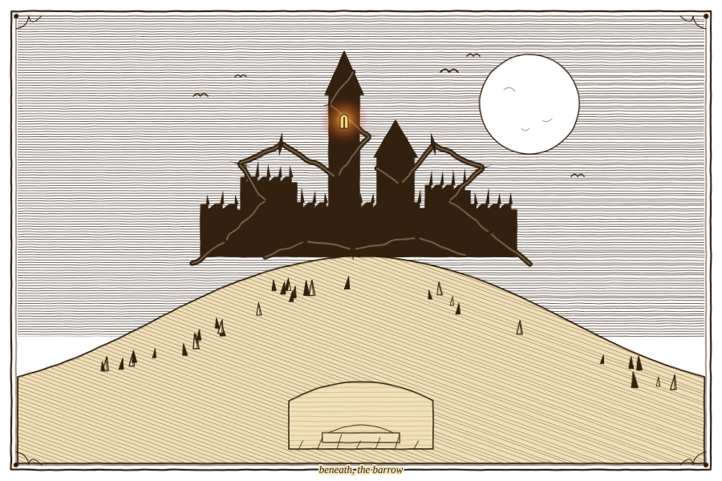
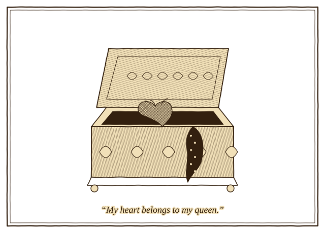
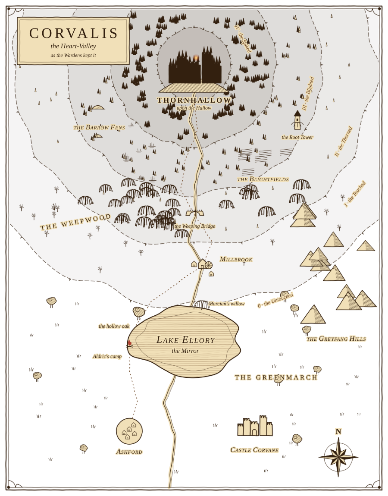
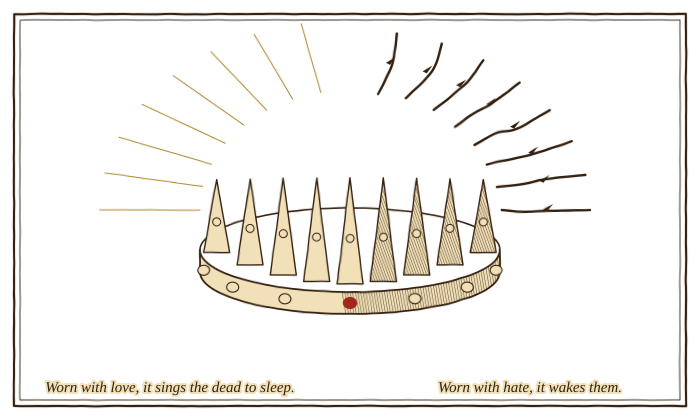
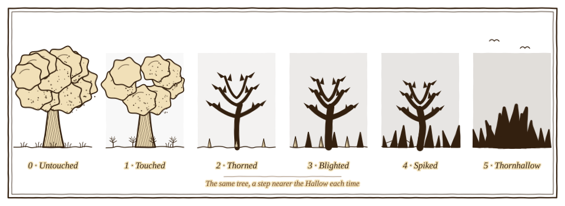
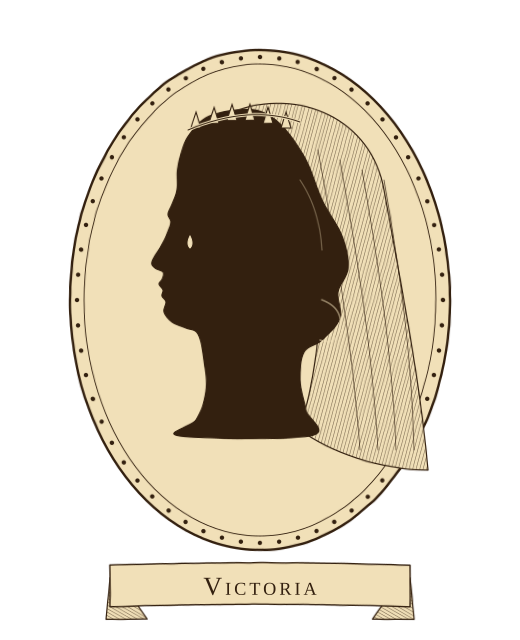
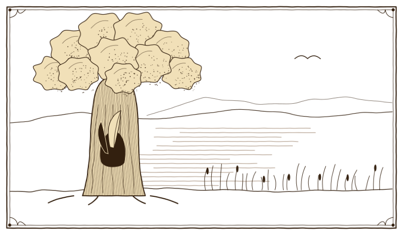
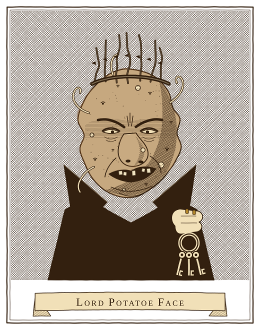
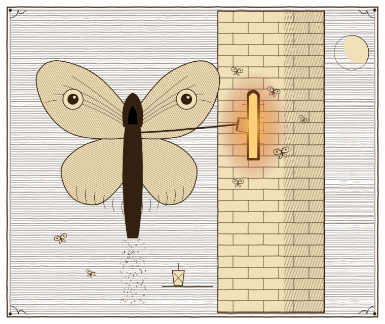
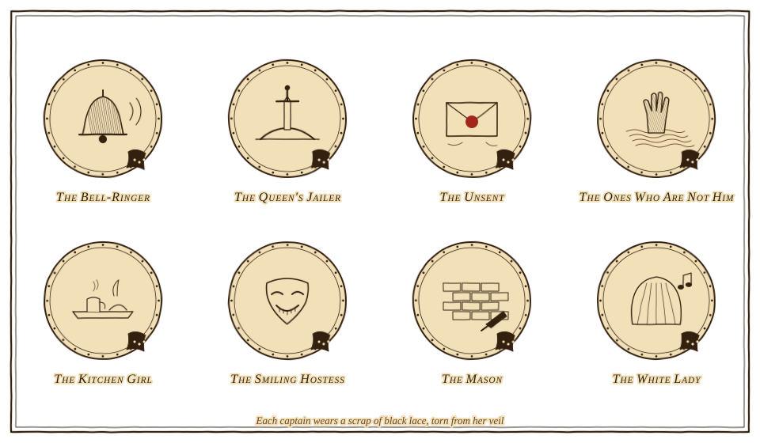

# Quest for Victoria

*The lore of Corvalis: the full story, its people, its places, and the secret at the heart of it.*

> **"Love and hate are one fire. What you feed it decides what it burns."**
> — a saying of the Wardens

<figure class="plate"><figcaption><b>Plate I.</b> Thornhallow upon the Hallow, and the barrow beneath it. One window is always lit.</figcaption></figure>

---

## The story in one breath

### What everyone believes (the heroes too)

Seven years ago, King Osric of Corvalis paid for a war with his daughter. He gave **Princess Victoria** in marriage to the court wizard **Lord Ambrose**, the man the whole realm calls **Lord Potatoe Face**, and the wizard carried her north to his castle, **Thornhallow**. She has not been seen outside its walls since. The common folk have a simpler word for it: *kidnapped*.

For years, strange things have come out of the north. The wizard's famous farmlands rotted, black thorns crept out across the fields, and travellers on the north road told of a grey stranger with a lantern who walked there at night. Everyone knew what it meant: the wizard's root magic had gone foul, and he had found something worse to learn from.

Forty days ago the old King died, and by law his crown passed to his only child. So the prisoner in the wizard's tower is now **Queen Victoria**. The wizard demanded the Crown of Dawn in her name, and the very next night the dead of Corvalis climbed out of their graves. They have risen every night since. The wizard proclaimed himself king by marriage, and the realm named him the **Hollow King**. Proclamations in his name are nailed to every church door, and the darkness he brought, the **Blackthorn**, creeps further south every week.

The Steward has called for heroes to cross the darkening land, defeat the wizard and **rescue the queen**. The heroes wake half drowned on the shore of Lake Ellory with no memory of how they got there, and take up the quest. Everything they find on the way (the wizard's dead captains, his rotted fields, the grey stranger on the roads, the queen's sad diary) tells them the same story: **the wizard, and whatever taught him, are the evil, and the queen is their victim.**

### What really happened

Victoria *was* a victim, for seven long years. She was sold against her will, and her love was murdered by her own father and her husband. Then she was locked in a tower room by a husband who beat her and humiliated her, made her smile at his feasts and sign his letters, and cut her off from everyone who ever loved her. Her father saw the bruises once, looked away, and never spoke to her kindly again, not even as he lay dying.

Someone watched all of it. **Archmagus Venn**, the wizard's cruel old master, thought dead for sixteen years, had come back as a thing of dust in a moth-grey cloak. He knew exactly what his pupil would do to an unwilling wife, because he had taught him. He knew she would break. In her third year he dropped a book of grave-magic through the slit of her bricked-up window, with a note: *For when you have had enough.*

Year by year, alone in that room, she turned to the only thing that answered her. The blight that spread out of Thornhallow was never the wizard's magic. It was her suffering, leaking into the land. When her father died, she took the wizard's heart, literally, and made him her puppet. She put on the Crown of Dawn with hate in her heart, and the crown that kept the dead asleep woke them instead.

Every one of the dead captains the heroes fight on the way north is someone from her story. Each is cursed to repeat forever what they did to her, or what she wished they had done.

### The twist

First the heroes hunt down the grey stranger, and destroy him in the ruins of the wizard's old tower, sure they have cut out the root of the evil. Then they fight their way into Thornhallow and destroy the Hollow King. The dead around the castle fall where they stand, the thorns go still, and for the first time in forty days grey morning light comes over the Hallow. It's over. They take the wizard's keys, climb the tower, and unlock the door to free the queen.

She is standing at the window, crying. *"You came,"* she says. *"Nobody ever came."* Then she picks up a silver box from the windowsill, opens it, and shows them the dead man's heart inside. *"Thank you for breaking him. I was so tired of his voice."* The light goes out, every dead thing in Thornhallow stands back up, and **the queen they came to rescue is the last enemy they will ever face.**

<figure class="plate"><figcaption><b>Plate XI.</b> The silver box on the windowsill.</figcaption></figure>

Only then does every clue the heroes collected snap into place. And the only way left to free her is to defeat her. When she finally falls, death does what nobody in her life ever did: it lets her go.

And the cruellest twist is the gentlest one: **the heroes are here because she called them.** Every tear Victoria cried in seven years fell from her tower window into the river and ran down into Lake Ellory. On the night she crowned herself, the last part of her that still remembered loving Marcian wept one more time and asked the lake for someone to stop her. The lake gave the heroes back.

---

## The heart of it: love and hate

Everyone in this story loves something and hates something, and every one of them, sooner or later, has to choose which of the two to feed. That choice is the whole game.

- **Love slowly turned to hate.** Victoria did not become a necromancer overnight. She held on to her love for years in a locked room while everything was taken from her one piece at a time. Hate did not beat love in a single blow. It wore it down, until the only way left to free her was to defeat her.
- **Hate born from not being loved.** Ambrose was mocked his whole life. He wanted one person to look at him gently, and when she wouldn't, he locked her up and hurt her until she would. She never did.
- **Love as a cage.** King Osric loved his dead queen so much that he could not bear to look at the daughter who reminded him of her. He saw her bruises and looked at the wall. He only found the words to say he was sorry when it was too late to say them.
- **Love that keeps the fire.** The Wardens, Aldric, Nan Merrow, Wren: they keep loving, even when it costs them everything. In the game this is literal: campfires, cooking, healing, the Warden talents.
- **Contempt that uses others.** Archmagus Venn has never loved anything, and is too cold even to hate. Gravecraft would not answer him, so he found someone it would answer, and handed her the book.
- **Her dead are her mirror.** Everyone who hurt Victoria is made to repeat their cruelty forever; everyone she loved is made to repeat their love. Her whole army is her heart, turned inside out.

| Character | Loves | Hates | What they choose |
|---|---|---|---|
| Victoria | Marcian; the lake; her mother's memory | Her father; her husband; everyone who looked away | Hate, slowly, over seven years, until death sets her free |
| Marcian | Victoria; the Wardens' oath | Nothing (that is his gift) | Love, even dead |
| King Osric | His late queen; the crown | Weakness; the daughter whose birth killed his wife | Hate dressed up as duty, then regret, too late |
| Lord Ambrose ("Potatoe Face") | Victoria (the idea of her) | Everyone who laughed at him; Marcian | To own what he could not earn, and to hurt it when it would not love him |
| Archmagus Venn, the Grey Moth | Nothing, except being right | Ambrose, who poisoned him; anything soft | To use her hate as his weapon |
| Warden Aldric | His brothers; the oath | The King; the wizard; himself, for surviving | Love |
| Wren | Her brother | The wizard; the crown; later, Victoria | Love, at the very last moment |
| Nan Merrow | Victoria, as her own daughter | The wizard; herself, for leaving | Love |
| Lady Isolde | Order; the realm | Chaos; the truth getting out | Herself |

---

## The world of Corvalis

### The land

**Corvalis** is a small green kingdom of meadows, mills and slow rivers, a soft place to look at. Its name comes from the old tongue: *cor*, heart, and *valis*, valley. The Heart-Valley.

- **In the south** lies the old royal country: the white **Castle Corvane** where the kings were crowned and are buried, and the walled market town of **Ashford**, where the Steward now rules.
- **In the middle** lies **Lake Ellory**, so still the villagers call it the Mirror, ringed by the green meadows of the **Greenmarch** and the mill village of **Millbrook**.
- **To the east** rise the bare, wind-bitten **Greyfang Hills**, where goblin and ogre clans keep their camps.
- **To the north**, up the river Lisle, the land climbs through the willow-choked **Weepwood**, past the black **Barrow Fens** and the wizard's rotted farmlands, to a lonely hill the old maps call **the Hallow**. On it stands **Castle Thornhallow**, Lord Ambrose's seat and the queen's prison.

Every step north, the land gets darker. (See *The Blackthorn* below.)

<figure class="plate"><figcaption><b>Plate II.</b> Corvalis, the Heart-Valley, from the green south to the Hallow, with the rings of the Blackthorn.</figcaption></figure>

### The founding: Morwen and Corvan

*What the songs say:* Corvan the Bold came to a valley full of restless barrows, sang the dead to sleep under the Crown of Dawn, and founded the House of Corvane.

*What really happened:* Five hundred years ago this valley belonged to the dead. A wandering sellsword named **Corvan** met **Morwen**, a grave-witch who could speak to the dead and make them listen. They fell in love. For his sake, Morwen sang the dead to sleep and bound them under a circlet of white gold she made with her own art: the **Crown of Dawn**.

Corvan was crowned king, and he and Morwen were wed. But a king who owes his throne to a witch is a king who can be unmade by her, and Corvan was afraid. On their wedding night his men carried Morwen north and sealed her alive in the deepest barrow of the Hallow, still in her wedding dress, with her book of grave-songs, the **Black Psalter**, walled up beside her. He told the realm his queen had died of a fever, took a gentler wife, and let the songs give him all the credit.

Morwen died in that barrow. Her book did not. Centuries later the lords of the northern march built a fortress on top of her hill and called it Thornhallow, and forty years ago a young, ambitious wizard named Venn went digging in its crypts and came out with the book.

### The Crown of Dawn

Morwen made the crown out of love, and it obeys the heart of whoever wears it. **Worn with love, it sings the dead to sleep. Worn with hate, it wakes them.** Every King and Queen of Corvalis has worn it, and none of them knew the second half of the rule, because none of them hated enough to find out. Only the Black Psalter records it. Everyone believes the wizard has twisted the crown with his dark arts. Victoria simply put it on.

<figure class="plate"><figcaption><b>Plate III.</b> The Crown of Dawn, after a drawing in the royal archive at Castle Corvane.</figcaption></figure>

### Three kinds of magic

- **Hearthcraft** is the quiet magic of the Wardens: a fire that keeps the cold out, food that heals, a second wind when you should have fallen. It is fed by care. It is the magic of the Warden talent tree.
- **Rootcraft** is the magic of the Root Tower: making seeds grow in a night, stone walk, mandrakes march. It is clever and proud. Lord Ambrose is its master, which is exactly why everyone believes the black thorns are his.
- **Gravecraft** is Morwen's art, forbidden for five hundred years: speaking to the dead and making them obey. It is fed by grief and by hate, and the more you feed it, the more of you it eats. It does not answer contempt, which is why the coldest wizard in Corvalis could never work it himself. Where it is used for long enough, the land itself sickens.

### The Wardens

An old order of rangers sworn to keep the roads, watch the barrows and guard the sleep of the dead. They wear grey-green cloaks, carry bone whistles, and swear one oath: ***"We keep the fire, so others may sleep."***

Seven years ago King Osric disbanded them by decree. The official reason was cost. The real reason was that one of them, Marcian, had dared to love his daughter. On the first Hollow Night, the old Wardens rode out anyway to hold back the dead. Only **Aldric** rode back.

### The Hollow Night

Since the night the crown went north, the dead rise across Corvalis every night: in the churchyards, in the fens, in the wild places where old barrows lie under the grass. Near Thornhallow they no longer bother to wait for dark. Each night there are more of them, and they wander a little further south. Villages bar their doors at sunset. Everybody blames the wizard.

---

## The Blackthorn: a land turning evil

The darkness did not arrive all at once, and it is not spread evenly. It started seven years ago in one locked room at the top of Thornhallow's tallest tower, and it has been seeping out ever since, like a stain through cloth. It came slowly while Victoria was only suffering, faster once she began to practise gravecraft, and in a great black wave on the night she put on the crown.

Folk call it the **Blackthorn**, for the black thorns that are always the first sign, and they all know whose it is: the first place it showed was the wizard's own potato fields, and what is rootcraft but making things grow? Where it spreads, the grass greys, the trees die and grow spikes, bones push up out of the ground like teeth, water turns dark, the light fails, and the dead stop sleeping. **The closer you get to Thornhallow, the worse it is.** The heroes' journey north is a journey into her heart, though they think it's a journey into his.

| Ring | Region | Levels | How it looks | What lives there |
|---|---|---|---|---|
| **0 · Untouched** | Lake Ellory and the Greenmarch | 1–3 | Green meadows, blue water, sunshine. The only darkness comes at night, when skeletons rise in the old barrows. | Slimes, cows, goblin raiders; skeletons at night |
| **1 · Touched** | Millbrook and the river farms | 3–7 | Crops wilting in patches, grey circles in the grass, the first thin black thorn-shoots along fences and ditches, crows everywhere. | Skeletons, bone hounds, goblins |
| **2 · Thorned** | The Weepwood | 7–11 | The willows' bark has gone black and their branches end in thorns; long spikes of pale bone grow up between the roots; the light comes down green and dim through grave-mist; the river runs dark. | Thornback wolves, giant spiders, wisps, mourners, the first Tower Guard |
| **3 · Blighted** | The Blightfields, the Barrow Fens, the Root Tower | 11–16 | The wizard's farmlands, rotted: black potato vines, fields of black spikes as tall as a man, bone fences, grey ash in the air, the dead walking even by day. | Tuberlings, screaming mandrakes, root golems, blightcaps, dustmoths, the Ones Who Are Not Him |
| **4 · Spiked** | The Spiked March, the road to the castle | 16–21 | No living plant. The earth cracked open, every crack bristling with black spikes; walls of thorn and brick taller than trees; green grave-fire in the ditches; a sky stuck at dusk. | Tower Guard, Wed-Wraiths, the Unseeing, the Veiled |
| **5 · Maximum** | Castle Thornhallow | 21–25 | Eternal night. Towers wrapped in giant black thorns, spikes on every battlement, bones in the mortar, green fire in the windows, the moat black as ink, and at the top of the tallest tower, one lit window. | Everything the dead have left |

<figure class="plate"><figcaption><b>Plate IV.</b> One tree, drawn again at every ring of the Blackthorn, from the Greenmarch to Thornhallow.</figcaption></figure>

**For the art and the level design:**

- **Same world, worse.** Each ring reuses the tiles of the one before it, corrupted one step further: grass goes from green to yellowed to grey to ash; an oak becomes a bare oak, then a thorned black oak, then a dead tree bristling with spikes; rocks crack, then sprout jagged black spikes; water darkens and starts to glow a sickly green.
- **Spikes are the signature.** Black thorns in ring 1, bone spikes in ring 2, spike fields in ring 3, walls and towers of spikes in rings 4 and 5. Spikes can be scenery, walls and (from ring 3 on) hazards that hurt to touch.
- **Light and time.** The days get dimmer and shorter going north: fog and colour grading thicken ring by ring, night comes earlier, ring 4 is stuck at dusk, and Thornhallow is always night.
- **Enemies grow spikes too.** The same creature in a darker ring comes back meaner and thornier: wolves become thornback wolves, tuberlings grow thorns, skeletons wear bone spikes.
- **Nothing heals early.** Beating a boss does not push the Blackthorn back: the land only gets darker as the heroes go north, and it stays dark behind them. A campfire still makes a small circle where the thorns can't reach, for one night. Only when Victoria falls does the Blackthorn wither, all of it, from the Hallow outward, ring by ring. The whole map turning green again is the game's last reward.

---

## The people

### Victoria Corvane: the Lost Princess, the Queen in the Tower, the Widow-Queen

*Twenty-six. Clever, stubborn, funny once; a beautiful singer who has not sung in seven years. The only child of King Osric and Queen Elowen, and now, by law, Queen of Corvalis.*

Victoria's mother died the night she was born, in a storm so loud nobody heard the baby cry. Her father never forgave her for it. He was never cruel to her face; he simply never looked at her. On every one of her birthdays (which was also the day her mother died) he went hunting with his hounds, and a child who is never looked at learns to make herself small. She was raised by her nurse, Nan Merrow, in the tall south tower that looks out over the lake.

At fifteen she slipped out in winter, walked onto the frozen lake to feel what freedom was like, and fell through the ice. A Warden apprentice with duckweed in his hair pulled her out, laughed at her, and walked her home without ever asking her name. She went back to the lake the next day, and the day after. That was Marcian. For four years they loved each other in secret, leaving notes and feathers for each other in a hollow oak on the shore.

Then her father sold her to the wizard to pay for a war. When she refused, her father and the wizard killed Marcian. A month later she was married in her mother's white veil, and the wizard carried her north to Thornhallow, where for seven years he beat her, shamed her in front of his guests, starved her when she disobeyed, and kept her locked away. **What she suffered there, year by year, is the heart of this story** (see *Seven years in the tower*). She went into that tower a grieving girl who still believed someone would come for her. Nobody came. Seven years later, what came out of it was the Widow-Queen.

Victoria does not want the crown. She does not want to rule. She wants every person in Corvalis to feel what she felt in that room, and then she wants Corvalis to be over. She says she is doing it for Marcian. Part of her knows he would hate it.

<figure class="plate"><figcaption><b>Plate V.</b> Victoria, from the cameo Nan Merrow keeps in her apron pocket.</figcaption></figure>

**In the game:** for four acts, the queen everyone is trying to rescue, seen only in portraits, songs, diary pages and letters, a victim the players come to love. After the Hollow King falls she is the **Widow-Queen** and **the final boss of the game**: a bride in a grey, rotting wedding dress and a veil that was white seven years ago and is black now, the Crown of Dawn on her head, burning cold. Defeating her is the only way left to free her.

### Marcian Ashdown: the Lost Love

*A miller's son from Millbrook who became the best tracker the Wardens ever had. Kind, quick to laugh, hopeless at singing. Dead at twenty-one.*

Marcian is the story's still centre: the one person who never chose hate, not even at the end. He loved Victoria before he knew she was a princess, and kept loving her after he found out, knowing exactly what it would cost. He was going to ask her to leave with him; he had made her a ring of plain Warden iron, engraved on the inside with the oath, *keep the fire*.

He received a letter in her handwriting asking him to meet her at the Weeping Bridge at moonrise. He went. She was not there. The King was, with his guards, and so was the wizard. The realm was told he had robbed the treasury and fled south. The King's men said they had sunk his body in the Barrow Fens. They hadn't.

<figure class="plate"><figcaption><b>Plate VI.</b> The hollow oak on the shore of Lake Ellory, where the feathers were left.</figcaption></figure>

**In the game:** dead before the story starts, but everywhere: in his sister's anger, in Aldric's grief, in the hollow oak, in the bone whistle found at the bridge. Of all the dead in Corvalis, he is the one Victoria could never find. At the very end, as she dies, his ghost answers a Warden whistle and comes to take her hand.

### King Osric III, "the Unbending": the Dead King

*Sixty-five when he died, forty days ago. Broad, grey, iron-jawed. A good general and a bad father.*

Osric loved his wife Elowen more than his kingdom, and when she died he decided that love was a weakness he would never suffer again. When the Greyfang War turned against him, he paid the wizard for victory with his daughter's hand, and did not think to ask her. When she said she would marry Marcian or no one, he said only, *"Then no one will have Marcian,"* and gave the order that night.

He visited Thornhallow once, in the third year. Victoria pushed up her sleeves, showed him the bruises on her arms, and begged him on her knees to take her home. He looked at the wall above her head and said, *"You are where you belong."* She swore that she would never speak to him again, and she kept that oath to the end.

Dying of a wasting sickness, Osric finally found the words he had never managed in twenty-six years, and wrote his daughter a letter asking her to come home and forgive him. The wizard read it first, and hid it. Victoria learned her father was dead from the sound of the bells.

**In the game:** dead at the start. In Act III the heroes hear that his tomb in Castle Corvane has been broken open *from the inside*, and everyone assumes the wizard stole the body to mock the crown. In Act IV they find his letter hidden in the wizard's desk, and hate the wizard even more for it. In the final battle the Dead King fights at his daughter's side, raised so that he would finally have to face her, and silent, because the dead cannot say they are sorry.

### Lord Ambrose Pellow: "Lord Potatoe Face," the Hollow King

*Archmage of the Root Tower, Lord of Thornhallow. Forty-six. Purple robes, a ring on every finger, and a face like a rotten potato: lumpy, pocked and sprouting, set in a permanent sneer.*

When Ambrose was twelve, an apprentice in the Root Tower, he botched a growing spell and ruined a whole field of seed potatoes. His master, Archmagus Venn, turned the boy's face into a tuber as punishment (lumpy, brown, with pale sprouts for eyebrows): *"Now your outside matches your work."* The curse, like all such curses, could be broken by one thing only: a kiss given freely, out of love. Venn ruled him for the next eighteen years the same way, with contempt and the back of his hand, until at thirty Ambrose poisoned his master's tea and took the Root Tower for himself.

Nobody ever gave him that kiss, and nobody ever will. The children of Millbrook chalked **POTATOE FACE** on the walls of the Root Tower, misspelled, and when he found out he had their fathers' fields salted. The name stuck anyway, all the way up to the royal court, where it was only ever whispered. Ambrose grew into the most brilliant wizard in Corvalis, and the most hated: petty, vain and vindictive, a man who never forgot a slight and never forgave one. He won the Greyfang War almost single-handed with his root-golems, and the King rewarded him with the northern march, the old fortress of Thornhallow, and the princess.

He did not love her. He wanted to own the one thing in Corvalis nobody could laugh at him for having, and he believed that if he kept her long enough she would have to love him, and the curse would break. When she refused him for a Warden, he went to the Weeping Bridge and called the roots up out of the riverbank to hold the young man still.

At Thornhallow he was exactly what he looked like. His court feared and despised him, bowed to his face and spat his name behind his back. At his feasts he would lay a ringed hand on his chest, announce *"My heart belongs to my queen!"*, and watch the table for anyone who forgot to smile. In private he was the cruellest person in her life, and he treated her exactly the way Venn had treated him. The first time she would not smile for his guests, he struck her at the table, and that night he wept and sent a new gown up to her room. It went on like that for seven years: rage, then gifts, then rage again. He punished her with hunger and with the dark. When she ran, he had her window bricked up and her door locked. When his fields began to rot and black thorns came up where his potatoes should have been, he decided his own magic was failing him, and locked her door twice. When the dying King's letter came, he read it, hid it in his desk, and told himself he was protecting her.

On the night of the King's death, Victoria came to his bedside for the first time in seven years, laid a hand on his chest and took his heart out of it. She keeps it in a silver box. Without it he still walks and talks and gives orders, but every word is hers, and through his mouth she has been running the kingdom's ruin. *"My heart belongs to my queen!"* Now it is simply true.

<figure class="plate"><figcaption><b>Plate VII.</b> Lord Potatoe Face, from a broadsheet nailed to the church door at Millbrook. Every passer-by spits on it.</figcaption></figure>

**In the game:** the villain the heroes hunt for four acts, and the man everyone in Corvalis hates. There is nothing funny about him: ugly, sneering and cruel to everyone beneath him, he fills the land with tuberlings and screaming mandrakes, nails his proclamations to every church door, and fills his journals with self-pity and spite. He is the Act IV boss. When he falls, it looks like the end of the story.

### Archmagus Venn: the Grey Moth

*Once master of the Root Tower. Poisoned sixteen years ago. Now a man-shaped drift of dust and moths in an old grey cloak, carrying a lantern.*

Venn was the cruellest teacher the Root Tower ever had. He turned his apprentice's face into a potato for one ruined harvest and kept him under his heel for eighteen years. He never loved anything, and was too cold even to hate; what he had instead was the certainty that everyone else was beneath him.

Forty years ago, digging in the crypts of the old fortress on the Hallow, he found Morwen's tomb and took her Black Psalter. The book would not answer him. Gravecraft feeds on grief and hate, and Venn had neither. It gave him one small thing: when Ambrose poisoned him, Venn did not stay dead. He came back as dust and moths inside his old grey cloak, too thin to work any great magic, and patient.

He knew his pupil. He had made him, one cruelty at a time, and he knew exactly what Ambrose would do to a wife who did not love him. From the Psalter he knew what the Crown of Dawn does in the hands of a Corvane who hates. So when the King gave Ambrose a princess and the castle on the Hallow, Venn followed them north, and watched the one lit window at the top of the tower, night after night, the way a moth does. In the third year, when her father had come and gone and the girl had stopped singing, he decided she was ready. He climbed to the slit of her window and dropped the book through it, with a note in his spidery hand: *For when you have had enough.*

He meant to use her: let her hate wake the dead, then take the crown from her and rule whatever she raised. She never let him near it. On the night she crowned herself he came to her window for his reward, and she shut it. Since then he has been raising a small court of his own dead in the ruins of the Root Tower, waiting for his chance.

<figure class="plate"><figcaption><b>Plate VIII.</b> The Grey Moth at the queen's window, from no witness. Nobody saw him come.</figcaption></figure>

**In the game:** a mystery for two acts. A grey figure with a lantern is glimpsed on the night roads, at the edge of the Weepwood, once on a tower wall far to the north. The heroes hunt him down in Act III, discover who he really is, and destroy him, sure that they have cut out the root of the evil: the dark master who taught the wizard everything. His dying words: *"You think it was me? I only gave someone a book. The rest, they did themselves."* Everyone takes *someone* to mean the wizard.

### Warden Aldric: the Last Warden

*Sixty-one. Scarred, patient, dry as old bread. The old man who pulls the heroes off the lakeshore.*

Aldric trained Marcian from a boy and loved him like a son. When Marcian vanished, Aldric went to the Weeping Bridge himself, found the young man's grey-green cloak snagged in the reeds and torn by roots, and went to court to demand the truth. The King's answer was to disband the Wardens. On the first Hollow Night, Aldric rode out with his brother Edric and the last of the old order to hold the dead back from the villages. Only Aldric came home. He wears the guilt like armour.

He is certain the wizard is behind it all, and that rescuing the queen is the last thing he can do for Marcian.

**In the game:** the mentor and first quest giver (already in the game). His old boots, his brother Edric's helm and Queen Elowen's amulet are the gifts he gives the heroes. He comes north with them for the assault on Thornhallow, and in the tower room, when the Widow-Queen's first blast of gravecraft comes for the heroes, Aldric steps in front of it. His last words are the Warden oath, and his death gives the heroes the Warden flame (a fitting home for the *Last Warden* talent).

### Wren Ashdown: Marcian's Sister

*Seventeen. A huntress from Millbrook with a short temper, a long bow, and her brother's laugh, which she hasn't used in years.*

Wren was ten when her brother vanished, and she never believed he ran. She grew up certain that the wizard had something to do with it, and she was right. She joins the heroes in Act II, learns the Wardens' feather-code from the letters in the hollow oak, and wants one thing: an arrow in Lord Potatoe Face. For four acts her hate is righteous and easy to cheer.

Then the Hollow King falls, and they open the tower door. Victoria was the person her brother loved most in the world, and Victoria is ending it. Wren has to decide what Marcian would have wanted, and whether she is willing to want it too.

**In the game:** a companion NPC from Act II. At the very end it is Wren who chooses to blow her brother's whistle, so that he can come for Victoria as she dies.

### Nan Merrow: Victoria's Nurse

*Seventy-four. Round, soft, sharp-eyed, smells of lavender and bread. She raised Victoria from the day she was born.*

Nan went north with Victoria after the wedding, the only familiar face in Thornhallow. Ambrose sent her away before the first winter was out: she was teaching the girl to hope, and he could not stand that anyone else had her love. Nan has lived in Millbrook ever since, writing letters to Thornhallow that were never answered, because they were never delivered. She cannot forgive herself for leaving, even though she was dragged out.

Since the Hollow Night began, pages of a diary have been blowing south on the night wind. Nan knows the handwriting. She collects every one, and she hates the wizard for every word.

**In the game:** the emotional anchor and the keeper of the diary. She is also the one who explains away the clues, out of love: when the queen's handwriting turns up on the Hollow King's proclamations, it is Nan who says *"He makes her sign his evil, the way he made her sign his letters."* At the end she is the voice that reminds Victoria who she was before all this.

### Lady Isolde Vane: the Steward

*The King's cousin and his Hand. Elegant, tireless, frightened.*

Since the King's death Isolde has held the realm together from Ashford with taxes, walls and bounties. She is the one who put out the call: *ten thousand crowns to whoever rescues the queen*. She is not a monster. She is a careful woman who did one terrible thing because her king asked her to, seven years ago: she wrote the letter that lured Marcian to the bridge, in a perfect copy of Victoria's handwriting. And forty days ago, when the wizard demanded the Crown of Dawn for the queen by law, she sent it north, because the law said so and she did not want to look at why.

**In the game:** the quest giver for the main bounty. As the story goes on, the heroes find proof she forged the letter, and her real motive becomes clear: she wants the queen *found*, not necessarily *alive*. A late political questline lets the heroes expose her.

### Old Tull: the Gravedigger

*Ancient, cheerful, morbid. "The dead are the best company. They never interrupt."*

The King's men brought Marcian's body to Tull with orders to sink it in the Barrow Fens. Tull couldn't do it. He buried the young man properly, by night, under the old willow on the north shore of Lake Ellory, with the iron ring still on its string around his neck. He has never told a soul. Lately he has been very worried about how many bodies have been pulled *out* of the fens.

**In the game:** a quirky NPC living in the Barrow Fens who knows every grave in Corvalis. In the last act he leads the heroes to Marcian's willow.

### Other faces

- **Gorrum Ninefingers:** chief of the Greyfang ogres. He lost a finger and a valley to King Osric's broken treaty, and he hates the crown with good reason. The Blackthorn is creeping into his hills too. A possible enemy, a possible ally.
- **Mother Skrit:** the goblin shaman of the Greyfang clans. Goblins call the Blackthorn *the Weeping*: *"Something up there is crying, and the ground cries with it."* Everyone takes it to mean the poor captive queen.
- **Maud Ashdown:** Marcian and Wren's mother, the miller's widow in Millbrook. She has set a lamp in her window every night for seven years in case her son comes home.
- **Edric:** Aldric's younger brother, a Warden lost on the first Hollow Night. His iron helm is the one Aldric gives the heroes.
- **Queen Elowen:** Victoria's mother, dead twenty-six years. Remembered as gentle and brave. Her amulet is the one Aldric gives the heroes (*"it was the queen's"*), and her white veil is the one Victoria wore to her wedding. Her spirit is not at rest (see *The White Lady*).
- **Morwen:** the grave-witch of the founding, five hundred years dead. She never appears; only her book does.

---

## The Mourning Court: the queen's dead

Most of the dead that rise on the Hollow Night are just the dead. But some were raised for a reason, and those are the Widow-Queen's own captains, her **Mourning Court**. The heroes call them *the wizard's captains*, and so does everyone else.

**The rule behind them:** every one of them is a reflection of Victoria's suffering or of her love.

- **Those who hurt her are cursed to do forever what they did to her once.** The bell-ringer rings, the jailer guards, the mason bricks, the hostess smiles.
- **Those she loved are made to do forever what she wished they had done.** The friend still brings her supper, and the mother she never knew still sings to a baby she cannot find.

Each captain wears a scrap of black lace tied around one arm, the way a knight wears his lady's favour. It is torn from her veil.

The heroes fight or meet them on the way north, and each one, looked at again after the twist, is a page of her story.

<figure class="plate"><figcaption><b>Plate IX.</b> The Mourning Court, as the heroes came to know it. Each wears a scrap of black lace.</figcaption></figure>

| Captain | Where (act) | Who they were | What they reflect | What they are made to do | What the heroes think |
|---|---|---|---|---|---|
| **The Bell-Ringer** | Millbrook bell tower (I) | Millbrook's old sexton, who rang the King's death knell | The bells that told her her father was dead, and she had never spoken to him again | Ring the death knell backwards, every night, waking the dead | The wizard mocks the captive queen with her father's death |
| **Sir Garrick, the Queen's Jailer** | The Weeping Bridge (II) | The knight who killed Marcian, then kept the key to her door for seven years | The murder of her love; the lock on her door | Stand guard at the bridge where he did it, forever | The wizard's champion, punished for his part in Marcian's murder |
| **The Unsent** | The roads at night (I–III) | Crane, Thornhallow's steward, who burned every letter she wrote on the wizard's orders | Seven years of letters that never left the castle; her loneliness | Carry a sack of her letters from door to door, forever unable to deliver one | A cursed courier of the wizard's; his letters show how cruelly she was kept |
| **The Ones Who Are Not Him** | The Barrow Fens (III) | Hundreds of bodies dragged up out of the bog | Her love: the King's men said they sank Marcian in the fens, so she raised the whole fen looking for him | Wander the fens turning over every face, murmuring *"not him... not him..."* | The wizard dredged the fens for an army |
| **The Kitchen Girl** | The road north (III–IV) | Tamsin, her only friend in Thornhallow, who brought her meals and bound her bruises | Her love, and the resurrection that went wrong | Carry a tray of cold supper up stairs that are not there, toward a door that is not there | A poor servant girl, cursed by the wizard |
| **Lady Mirabel, the Smiling Hostess** | Thornhallow's feast hall (IV) | The court lady who named her *Lady Potatoe* behind a fan, and laughed the night he struck her at table | The endless feasts where she had to smile and be seen | Host the feast forever with a smile she cannot stop, serving ash to dead guests | The wizard's cruel court, still feasting while the land dies |
| **The Mason** | The Spiked March (IV) | Master Hobb, who bricked up her window after she ran | Her prison | Build walls forever: thorn, brick and bone across every road north, muttering *"One more course, m'lord, and she'll never get out"* | The wizard is walling the queen in |
| **The White Lady** | Thornhallow's chapel (IV) | Queen Elowen, raised from her tomb in Castle Corvane | The mother she never had | Drift through the halls humming a lullaby, looking for a baby she cannot find | The wizard stole the dead queen's body to torment her daughter |
| **The Hollow King** | Thornhallow's throne (IV) | Lord Ambrose | The husband who owned her and hurt her | Sit on a throne with an empty chest and say *"My heart belongs to my queen!"* | The villain behind everything |
| **The Dead King** | The Barrow of the Hallow (V) | King Osric | The father who saw her bruises and looked at the wall | Fight at her side, face her, and say nothing, because the dead cannot apologise | *(after the twist)* |

The Grey Moth is not one of them. He never belonged to her; she was only ever his tool, and she knew it.

---

## Seven years in the tower

*Victoria did not fall in one night. This is what was done to her, and what she did, year by year. Before the twist, the players only ever see the suffering. After it, they understand what grew out of it.*

**Before the tower.** Her father sells her hand to pay for a war, without asking her. She refuses. Her father and her future husband murder the man she loves, and the realm is told he was a thief who ran. She is married a month later in her mother's white veil, with her mouth shut, and carried north that same night.

**The first year: duty, and the first blow.** Thornhallow is cold and grey and far from the lake. Her days are not her own. She is to sit at the wizard's side at his feasts and smile at his guests, wear the gowns he chooses, receive the lords of the march, sign the letters he writes in her name, and be seen. The ladies of the court call her *Lady Potatoe* behind their fans. The first time she will not smile, he strikes her at the table, in front of everyone, and a few of them laugh. That night he weeps outside her door and sends up a new gown. Before winter is out, he sends Nan away. Victoria writes home every week. The steward burns every letter.

**The second year: the lock.** One spring night she climbs out of her window and runs south for the lake. Sir Garrick catches her on the road at dawn and carries her back. The wizard leaves her three days without food or a candle, and the mason bricks her window up to a slit. From then on her door is locked from the outside, and she leaves her room only when she is needed downstairs. She stops singing, because the only person left to hear her is the man who keeps the key.

**The third year: the visit.** Her father comes to Thornhallow, once. She pushes up her sleeves to show him the bruises, goes down on her knees and begs him to take her home. He looks at the wall above her head and says, *"You are where you belong,"* and leaves the next morning without saying goodbye. She swears she will never speak to him again. That winter a big grey moth starts coming to the slit of her window every night, drawn to her candle. She is glad of the company. One night something heavier than a moth lands on the sill: a book bound in grey cloth, and a note in a spidery hand. *For when you have had enough.*

**The fourth year: the book.** She reads it the way a drowning person breathes. Her first spell brings a dead moth back to beat against the window slit. She cries all night, and then she does it again. She writes to Marcian, though he is dead: *I know where they put you. I'm going to bring you home.* That autumn, the first bodies start crawling up out of the Barrow Fens, and none of them is him.

**The fifth year: Tamsin.** Her one friend, the kitchen girl who brought her meals and news and flowers and bound her bruises, falls sick with the grey sickness that has started creeping out of the tower. Tamsin dies. Victoria brings her back, and what comes back is not Tamsin. It only wants to carry a tray up the stairs. Victoria cannot bear to put her down, so she lets her wander. After that she stops crying.

**The sixth year: the thorns.** Black thorns sprout in the castle garden, then in the wizard's fields. His potatoes rot in the ground and come up black. Wolves in the Weepwood start growing bone along their spines. The peasants say the wizard's magic has gone foul, and Ambrose, terrified, believes them. He locks her door twice to keep her safe from it.

**The seventh year: the bells.** Her father falls ill. Dying, he writes her a letter at last, asking her to come home and forgive him. Ambrose reads it, and hides it in his desk. Forty days ago the bells of every chapel in Corvalis toll for the King, and that is how Victoria learns her father is dead. She never spoke to him again. Now she never can.

**That night.** She goes to her husband's bed for the first time in seven years, lays her hand on his chest and takes out his heart. *"You took mine at the bridge,"* she tells him. *"I'm only taking it back."*

**The next day.** Through Ambrose's mouth she demands the Crown of Dawn, which by law belongs to the queen. The Steward sends it north. Victoria puts it on in her tower room with nothing left in her heart but hate, and every grave in Corvalis opens. The Blackthorn bursts out of Thornhallow like a flood. She calls her court: the bell-ringer, the jailer, the steward, the hostess, the mason. In Castle Corvane, two tombs break open from the inside, and the dead King and Queen begin the long walk north. That night the grey moth comes to her window for his reward, and she closes the shutter on him.

**And one last thing.** Before dawn, alone at the slit of her window, Victoria cries one last time. The tear falls into the moat, runs down the Lisle into Lake Ellory, and the last of her love asks the water for someone to stop her.

---

## What really happened

*The secret timeline. The players learn it a piece at a time, and only see the whole of it after the twist.*

| When | What happened |
|---|---|
| 500 years ago | Morwen sings the dead to sleep and makes the Crown of Dawn. Corvan is crowned, weds her, and seals her alive in the barrow under the Hallow on their wedding night, with her Black Psalter. |
| 40 years ago | Venn, a rising wizard of the Root Tower, digs in the crypts of the old fortress on the Hallow, finds Morwen's tomb and takes the Black Psalter. It will not answer him. |
| 34 years ago | Venn turns his 12-year-old apprentice Ambrose's face into a potato. The village children name the boy Potatoe Face. |
| 26 years ago | Queen Elowen dies giving birth to Victoria. King Osric never holds his daughter. |
| 16 years ago | Ambrose, 30, poisons Venn and takes the Root Tower. Venn does not stay dead: he rises as the Grey Moth. |
| 11 years ago | Victoria (15) falls through the ice of Lake Ellory. Marcian (17) pulls her out. The notes and feathers in the hollow oak begin. |
| 8 years ago | The Greyfang War. Ambrose offers his root-golems for the princess's hand; Osric agrees without asking her. The war is won at the Field of Roots. Ambrose is given the northern march and Thornhallow. |
| 7 years ago | Victoria refuses: Marcian or no one. *"Then no one will have Marcian."* Isolde forges the letter. At the Weeping Bridge, Ambrose's roots hold Marcian and Garrick's sword kills him while the King watches. Tull secretly buries him under the willow. The Wardens are disbanded. |
| 7 years ago, a month later | The wedding. Victoria is carried north to Thornhallow. *The wizard took the princess.* The Grey Moth follows. |
| Years 1–3 | Duty, his blows, the lock, her father's visit. The Grey Moth watches her window. |
| The third winter | The Grey Moth drops the Black Psalter through her window slit: *For when you have had enough.* |
| Years 4–6 | The book, the fens, Tamsin, the thorns. The Blackthorn creeps out from Thornhallow, and everyone blames the wizard's magic. |
| 41 days ago | The dying King writes to Victoria asking forgiveness. Ambrose hides the letter. |
| 40 days ago | King Osric dies. Victoria hears the bells. That night she takes Ambrose's heart. |
| 39 days ago | Through Ambrose, she demands the Crown of Dawn; Isolde sends it. Victoria crowns herself with hate, and the dead wake all across Corvalis. She raises her Mourning Court. The King's and Queen's tombs break open. The Blackthorn surges south. Ambrose proclaims himself king by marriage: the Hollow King. The Grey Moth is shut out, and goes back to the Root Tower to raise dead of his own. The first Hollow Night: the old Wardens ride out, and only Aldric comes back. Victoria's last tear reaches the lake. |
| Now | The Steward offers a fortune to whoever rescues the queen. The lake gives back the heroes, and Aldric finds them on the shore. |

---

## The trail of hints

*The twist only works if the players could have seen it coming, and didn't. So every act leaves a few clues. Each one has an innocent reading that fits what everyone believes ("the wizard and his dark master did it; the queen is their victim"), and often a character right there to say it out loud. After the Hollow King falls, the players should be able to look back at every one of them and think: of course.*

| Act | The clue | What everyone thinks it means | What it really means |
|---|---|---|---|
| Prologue | The Hollow King's proclamations nailed to every church door, signed *Ambrose, King* and, below, in a fine hand, *Victoria R.* | *"He makes her sign his evil, the way he made her sign his letters."* (Nan, Aldric) | She wrote them. He signed. |
| Prologue–II | Tales of a **grey stranger with a lantern** on the north road at night, and once on a tower wall | The wizard's dark master, or his spy | Venn, who watched her window for three years and gave her the book |
| I | The **black lace favour** on the Bell-Ringer's arm, and on every captain after him | The wizard tore up the poor queen's wedding veil and handed it out to his creatures, to shame her | A lady's favour, given to her knights. It is her veil, and it has turned black. |
| I | The Bell-Ringer's last words: *"She hears every bell..."* | The wizard torments the captive queen with her father's death knell | She chose bells to wake the dead, because bells told her he was gone |
| I–III | **The Unsent's letters**, left on doorsteps (see below) | Proof of how cruelly she was kept: seven years of letters he burned | The letters slowly change: from begging, to grief, to something else |
| II | Garrick's last words: *"Tell her I'm sorry. I should have let her run. And the grey thing at her window, every night, the year before the thorns. I should have shot it."* | An apology to the prisoner he guarded; the wizard's spy tormenting her | An apology to the mistress who raised him; the Grey Moth bringing her the book |
| II | A **fresh black crow feather** in the hollow oak. In the Wardens' feather-code, Wren reads it as *"I'm coming"* | Someone still visits the oak. Maybe Marcian's ghost? | Victoria sends her crows to the oak. It is a message to Marcian. |
| III | The Ones Who Are Not Him, murmuring *"not him"* | The wizard is digging up an army and can't find what he wants | She was searching for Marcian's body |
| III | The Kitchen Girl's tray: cold supper, a feather from the lakeshore, a note reading *"for my lady"* | A cursed servant still trying to feed the captive queen | Her friend, brought back wrong, and kept because she could not bear to let her go |
| III | The King's **and** the Queen's tombs broken open from the inside | The wizard desecrates the royal line to break the realm's spirit | She called her parents to her |
| III | Mother Skrit: *"Something up there is crying, and the ground cries with it."* | The captive queen's sorrow; the wizard's blight feeding on it | Exactly what it says |
| III | A diary page: *"A big grey moth comes to my window every night now. I think it likes my candle. I'm glad of the company."* | A lonely girl, poor thing | The Grey Moth, choosing his moment |
| III | In the Grey Moth's lair, a notebook of dates and one line, written over and over: *"The light in the high window. Not yet."* The last entry: *"Now."* | He was spying on the wizard's castle, plotting with his pupil | He was waiting for her to break |
| III | The Grey Moth's dying words: *"You think it was me? I only gave someone a book. The rest, they did themselves."* | He gave the wizard his black arts | He gave the queen the Black Psalter |
| III | Ambrose's journal: *"The thorns come from her tower. They want her too. I must keep her safe,"* and the last entry: *"I feel nothing today. Nothing at all. Not even for her. How strange."* | The wizard, mad with dark magic, losing the last of his humanity | The thorns came *from* her. And he had no heart left to feel with. |
| IV | The White Lady spares whoever wears Elowen's amulet, and hums Nan's lullaby | A mother's love, stronger than the wizard's curse | Her daughter raised her, and taught her the only lullaby she knew |
| IV | The King's last letter, found hidden in the wizard's desk | More proof of the wizard's cruelty: he kept a dying father from his child | Still true, and the last thing she reads |
| IV | The Hollow King, all fight long: *"My heart belongs to my queen!"* | The wizard's sickening, possessive boast | Literally |
| IV | When he falls, every dead thing in Thornhallow falls with him, and morning light comes over the Hallow | It's over. The rescue is won. | She let them fall, so the heroes would come up the stairs |

### Some of the Unsent's letters

> **To the King, at Castle Corvane** *(first year).* Dear Father. I will do my duty. I will smile at his feasts and I will sign what I am given. I only ask that Nan may stay with me. Please. She is all I have. Your daughter, Victoria.

> **To Nan Merrow, Millbrook** *(first year).* Nan, he says you were sent away for stealing. I know you never stole anything in your life except cake for me. I will find a way to bring you back. Don't forget me.

> **To the King, at Castle Corvane** *(second year).* Father, they have bricked up my window. I can see one stripe of sky. He hurts me, Father. He hurts me, and then he cries and brings me dresses. I will be good. I will be so good. Please let me come home.

> **To Marcian Ashdown, the Barrow Fens** *(fourth year).* They told me you ran away. I never believed it. Now I know where they put you. Wait for me. I am going to bring you home.

> **To the mother of Tamsin Reed, Thornhallow village** *(fifth year).* Your daughter was the kindest person in this house. She was my only friend. I tried to send her back to you. I'm sorry she came back wrong.

> **To no one** *(seventh year; the last letter in the sack, never addressed).* The bells are ringing. I suppose everyone will be very sad. I find I am not sad at all.

---

## The adventure

The campaign runs from level 1 to 25 across a prologue and five acts, and the map runs from the green south to the black north. Each act takes the heroes one ring deeper into the Blackthorn. They defeat two villains they believe in, the Grey Moth and then the Hollow King, before they meet the one they came to save.

### Prologue: The Lake Gives Back (levels 1–3, ring 0)

**Where:** Lake Ellory and the Greenmarch.
**What the players believe:** nothing yet. They are nearly naked, have no memory, and hold a rusty sword.

Aldric pulls the heroes off the shore and teaches them to survive: clear the slimes, build a fire, cook, mine, raise a forge, forge Warden steel. (This is the quest chain already in the game.) He tells them about the Hollow Night, the wicked wizard in the north and the poor queen in his tower, and that the lake does not give things back without a reason. The Hollow King's proclamation is nailed to the post by his camp, and the drovers swear they've seen a grey man with a lantern walking the north road after dark.

**Closing beat:** the heroes survive their first night of the dead, and Aldric gives them his brother's helm.

### Act I: The Hollow Night (levels 3–7, ring 1)

**Where:** Millbrook and the river farms.
**What the players believe:** an evil wizard has held the queen prisoner for seven years, and now he is using her crown and his foul magic to raise the dead.

The Steward's heralds ride through with the bounty: ten thousand crowns to whoever rescues the queen. In Millbrook the heroes meet **Nan Merrow**, who gives them the first pages of Victoria's diary (a girl falling through the ice and being pulled out by a laughing boy), and **Maud Ashdown**, who keeps a lamp in her window for a son the realm calls a thief. The first black thorns are pushing up through the fences. At night a grey postman walks the village lanes, knocking on doors and leaving letters: **the Unsent**.

Something is ringing the Millbrook chapel bell backwards every night and raising the village dead. The heroes climb the bell tower to stop it.

**Enemies:** skeletons, bone hounds, slimes, goblin raiders.
**Boss:** **The Bell-Ringer**, Millbrook's old sexton, ringing the death knell backwards until the bell cracks.
**Closing beat:** on the Bell-Ringer's arm, a scrap of black lace. Nan turns it over in her hands. *"That's from a wedding veil. Hers was white. That monster tore it up and gave it to his creatures."*

### Act II: The Weeping Bridge (levels 7–11, ring 2)

**Where:** the Weepwood and the river Lisle.
**What the players believe:** the wizard is a murderer too, and the queen is his victim twice over.

**Wren Ashdown** finds the heroes and makes them help her follow her brother's old trail north. The road leads into the Weepwood, and the forest has turned. The willows are black and thorned, spikes of bone stand between the roots like a second forest, and the light comes down green through the mist. Thornback wolves hunt in packs; wisps lure travellers off the path to unmarked graves; once, a lantern moves between the trees, and is gone. On the lakeshore at the forest's edge the heroes find the hollow oak, still full of Victoria and Marcian's notes and feathers, and one feather that is new. Deep in the wood, a knight in rusted royal armour guards the Weeping Bridge and lets no one pass.

<figure class="plate"><figcaption><b>Plate X.</b> The Weeping Bridge, and the knight who will not leave it.</figcaption></figure>

**Enemies:** thornback wolves, giant spiders, Mourning Lights (wisps), mourners, the first Tower Guard.
**Boss:** **Sir Garrick Thorne, the Queen's Jailer**, guarding the scene of his crime.
**Closing beat:** freed, Garrick's ghost confesses everything: the forged letter, the wizard's roots, his own sword, the King on his horse watching, and seven years outside a locked door, listening to what the wizard did behind it. He tells them about the grey thing at her window. He gives the heroes Marcian's bone whistle, and asks them to tell her he is sorry. Wren now knows who killed her brother: the King and the wizard. The players have never hated Lord Potatoe Face more, or pitied the queen more.

### Act III: Roots and Ruin (levels 11–16, ring 3)

**Where:** the Blightfields, the Barrow Fens, the Greyfang Hills and the Root Tower.
**What the players believe:** the wizard learned his black arts from someone, and that someone is out here.

North of the Weepwood lie the wizard's old farmlands, and they are the worst thing the heroes have seen yet: black potato vines strangling everything, fields of spikes as tall as a man, bone fences, ash falling like snow, and the dead walking in broad daylight. Tuberlings waddle through the ruins in thorny swarms, and mandrakes scream from the soil. It all looks exactly like rootcraft gone wrong.

- In the **Barrow Fens**, hundreds of the Drowned turn over every face they find, murmuring *"not him"*. **Old Tull** grumbles that somebody has been pulling bodies *out* of his bog, and that he once buried a young man somewhere he wasn't supposed to.
- On the road north the heroes meet **the Kitchen Girl**, endlessly carrying a tray of cold supper toward a door that isn't there.
- The heroes finally run down **the Unsent** and free him, and inherit his sack: seven years of the queen's letters.
- East in the Greyfang Hills, **Gorrum Ninefingers** can be fought or won over, and **Mother Skrit** tells them the land is weeping.
- A rider from Ashford brings news: **the King's and the Queen's tombs have both been found broken open from the inside**, and the bodies are gone.
- The grey lantern is seen again, every night now, always going the same way: to the Root Tower.

At the heart of the Blightfields stands the **Root Tower**, the wizard's old home, overgrown, screaming, and full of moths. In its cellars the **Mandrake Mother**, Ambrose's greatest creation rotted black, guards the stair. In the study the heroes find **Ambrose's journal**: thirty years of loneliness, then seven years of a man keeping a woman he says he loves behind a locked door, telling himself it is for her own good. The last entries are those of a man going mad with his own magic: the thorns, the fear, and at the very end, *nothing at all*. At the top of the tower, among his own small court of dead, waits the grey stranger.

**Enemies:** tuberlings (now thorned), screaming mandrakes, root golems, blightcaps, dustmoths, the Ones Who Are Not Him, goblins, goblin shamans, ogres.
**Mid-boss:** **The Mandrake Mother**, a mandrake the size of a cottage whose scream can be heard in Ashford.
**Boss:** **The Grey Moth**. Under the hood there is no face, only dust and moths, and a voice the old books in the study already named: Archmagus Venn, the master who cursed the wizard's face and taught him everything. He fights by putting out the lights, and comes apart into moths when struck.
**Closing beat:** the Grey Moth dies laughing: *"You think it was me? I only gave someone a book. The rest, they did themselves."* The heroes believe they have cut out the root of the evil. But the thorns keep growing, and the Hollow King still sits on his throne. Nan, reading the journal, spits on the floor. *"Then it's the wizard. It was always the wizard."*

### Act IV: The Hollow King (levels 16–21, rings 4–5)

**Where:** the Spiked March and Castle Thornhallow.
**What the players believe:** this is the end. Kill the wizard, free the queen.

The road north becomes the **Spiked March**: no living thing, the earth split open and bristling with black spikes, green grave-fire in the ditches, a sky that never gets past dusk, and walls of thorn, brick and bone across every road, still being built by **the Mason**. Aldric joins the heroes for the final push. In Ashford, meanwhile, the heroes find proof that the Steward forged the letter that killed Marcian.

Then the castle. Thornhallow is wrapped in giant black thorns, spikes on every battlement, bones in the mortar, and it is always night. The heroes fight through:

- **The feast hall**, where dead lords still sit at the wizard's table, served ash by **Lady Mirabel, the Smiling Hostess**, who cannot stop smiling.
- **The chapel**, where **the White Lady** drifts humming Nan's lullaby, and lowers her hands when she sees Elowen's amulet.
- **The wizard's study**, where they find a letter sealed with the royal seal and never opened: the dying King's letter to his daughter. One more crime to lay at the wizard's feet.
- **The throne room**, where Wed-Wraiths, the veiled ghosts of every bride House Corvane ever married off, watch from the galleries and do not attack.

**Enemies:** Tower Guard, Wed-Wraiths, the Unseeing, the Veiled, raised courtiers.
**Captains:** the Mason (Spiked March), Lady Mirabel (feast hall), the White Lady (chapel, may be avoided).
**Boss:** **Lord Potatoe Face, the Hollow King**, on his throne in a crown of roots. He fights with everything the Root Tower ever taught him, sneering and vicious to the last, his hand on his chest: *"My heart belongs to my queen!"*

**The false victory.** He falls. Every dead thing in the castle falls with him. The thorns on the walls go still. Grey morning light comes through the windows of Thornhallow for the first time in forty days. Aldric laughs and weeps at once: *"It's done. Gods, it's done."* The heroes take the iron key ring from the wizard's belt, and climb the tallest tower to free the queen.

**The twist.** The door at the top is locked from the outside, as it has been for seven years. The heroes unlock it. Inside, a young woman in a grey wedding dress stands at a bricked-up window slit, crying.

> *"You came. Nobody ever came."*

She picks up a silver box from the windowsill and opens it. Inside is a heart, grey and still.

> *"Thank you for breaking him. I was so tired of his voice."*

The morning light goes out. Below, every dead thing in Thornhallow stands back up. The first blast of gravecraft comes for the heroes, and Aldric throws himself in front of it, and dies keeping the fire. When the heroes can see again, the queen is gone: down through the floor, into the barrow under the hill. On her bed lies her diary, open.

### Act V: The Quest for Victoria (levels 21–25, ring 5)

**Where:** Lake Ellory and Marcian's willow, then the Barrow of the Hallow beneath Thornhallow.
**What the players know:** everything, finally, and every clue they carried comes back to them. The queen they came to rescue is the evil they came to stop, and the only way to free her now is to defeat her.

The heroes carry Aldric's body home to the lake and light a fire for him. Nan reads them the last pages of the diary (the moth, the book, the fens, Tamsin, the bells), and for the first time she has no innocent explanation left. Wren has to decide whether she still wants to shoot someone, and who. **Old Tull** confesses where he really buried Marcian, and under the willow on the north shore the heroes find the iron ring with *keep the fire* inside. In the reeds nearby they find the last page of the diary (see below).

Then down: into the **Barrow of the Hallow**, beneath the castle, the old tomb where Venn found the book. Its chambers have shaped themselves around Victoria's memories: a hall of black ice like the frozen lake, an endless feast, a room with no windows, a throne room where a grey king looks at the wall, a library of one book, a kitchen, a bell tower. The echoes of her captains wait in them. At the bottom, on a throne of bones, waits the queen.

**Enemies:** everything the dead have left: Wed-Wraiths, bone hounds, the Drowned, the Veiled (living people with broken hearts who heard her call), the Tower Guard, echoes of the Mourning Court.
**Final boss: Victoria, the Widow-Queen.**

1. **The Widow-Queen.** Victoria fights with gravecraft and seven years of contempt: black thorns erupt across the floor, the lights go out one by one, and the dead answer her voice.
2. **The Dead King.** She raises her father to fight at her side: a grey, crowned corpse, still in his burial robes, that cannot speak.
3. **The Mourning Court.** As she weakens, the echoes of her captains rise around her one last time (the bell, the bricks, the endless smile), and the Blackthorn closes in on the heroes from every side.
4. **The fall.** The heroes bring her down.

---

## The ending: Set Free

When the Widow-Queen finally falls, the Crown of Dawn cracks across her brow and shatters on the stone, and the heroes kneel beside a dying young woman in a grey dress. They give her the letter her father wrote and her husband hid, and she reads it with the last of her strength. She says it is too late, and it is, but her hands are shaking. They put Marcian's ring in her palm. And Wren, who came all this way to shoot someone, lifts her brother's bone whistle and blows the Warden call.

A Warden answers it from across the dead: Marcian, the one body in Corvalis she could never find, come at last to find her. Death does what nobody in her life ever did: it lets her go. Her ghost rises a girl again, in a white veil, and takes his hand.

Across Corvalis the dead lie down. The Mourning Court is released one by one: the bell stops, the bridge is empty, the Unsent's sack falls open, the Kitchen Girl sets her tray down at last, and the White Lady finds the baby she was looking for and holds her. King Osric lies down at his daughter's side. The Blackthorn begins to wither from the Hallow outward, ring by ring, the way it came.

At dawn the heroes carry her body home and bury her under the willow on the north shore of Lake Ellory, beside Marcian. Nan, Wren and the heroes watch two figures walk out across the Mirror hand in hand, and the water closes over them without a ripple. That night the heroes burn the Black Psalter in a Warden's campfire.

The Crown of Dawn is gone: white-gold splinters on the barrow floor, and nobody will ever wear it again. The dead sleep anyway. There is nobody left who hates enough to wake them, and the Wardens are reborn, with the heroes as the first of the new order, to keep it that way the old way: by keeping the fire.

---

## Places

| Place | Ring | What it is | Who and what is there |
|---|---|---|---|
| **Lake Ellory, "the Mirror"** | 0 | The still lake at the heart of the realm, fed by the Lisle from the north | Where the heroes wake; where Marcian saved Victoria; the hollow oak; Marcian's willow on the north shore |
| **The Greenmarch** | 0 | Meadows, mills and cattle around the lake | Aldric's camp, slimes, cows, the first goblin raids |
| **Ashford** | 0 | A walled market town in the south | Lady Isolde, the bounty board, the forged-letter trail |
| **Castle Corvane** | 0 | The white royal castle in the south, half empty | The royal crypt; two tombs broken open from inside |
| **Millbrook** | 1 | The mill village on the Lisle | Nan Merrow, Maud Ashdown, the backwards bell, the Unsent's first letters |
| **The Greyfang Hills** | 1–2 | Bare, windy highlands to the east | Goblin and ogre clans, Gorrum, Mother Skrit, the Field of Roots |
| **The Weepwood** | 2 | A willow forest gone black, thorned and full of bone spikes | Thornback wolves, spiders, wisps, the Weeping Bridge |
| **The Weeping Bridge** | 2 | An old stone bridge over the Lisle | Where Marcian was murdered; the Queen's Jailer |
| **The Barrow Fens** | 3 | Black bog full of old burial mounds | The Ones Who Are Not Him, Old Tull's hut |
| **The Blightfields** | 3 | The wizard's farmlands, rotted to spikes and ash | Tuberlings, mandrakes, the Kitchen Girl on the road |
| **The Root Tower ("the Spud Spire")** | 3 | Ambrose's old tower, overgrown, screaming and full of moths | The Mandrake Mother, Ambrose's journal, the Grey Moth and his notebook |
| **The Spiked March** | 4 | The road to the castle: cracked earth, spikes, walls of thorn and brick, endless dusk | The Mason, the Unseeing, Wed-Wraiths |
| **Castle Thornhallow ("the Spud Keep")** | 5 | The wizard's castle on the Hallow, wrapped in thorns, always night | The feast hall, the chapel, the wizard's study, the throne room, the Hollow King |
| **The Tower Room** | 5 | Victoria's prison for seven years | The twist; the silver box; the diary |
| **The Barrow of the Hallow** | 5 | Morwen's old tomb beneath the castle, its chambers shaped like Victoria's memories | The Widow-Queen, the Dead King |

---

## Bestiary

Creatures marked *thorned* come back in darker rings with spikes, more health and nastier attacks. Every kind of the queen's dead is, in some way, a piece of her story; the heroes only see that afterwards.

### The Restless (the queen's dead)

- **Skeleton:** the common dead, risen everywhere so that everyone in Corvalis loses someone, the way she did. They climb out of the ground at sunset and sink back at dawn, except near Thornhallow, where they don't bother. *Thorned* in rings 3 and up. *(In the game now.)*
- **Bone Hound:** the skeletons of her father's hunting dogs, the ones he took out on every one of her birthdays instead of seeing her. Fast; they run in packs.
- **Mourner:** a weeping ghost that heals the dead around it with its wail: all the mourning she was forbidden, because a thief's lover may not wear black. Interrupt it.
- **The Ones Who Are Not Him (the Drowned):** bloated dead from the Barrow Fens, raised one by one while she searched for Marcian. Slow, heavy; they grab and pull, and look into your face.
- **Wed-Wraith:** the veiled ghost of a Corvane bride married off against her will. They were her first friends in the dark. Their shriek silences spells.
- **Tower Guard:** the guards who stood outside her door for seven years, still standing guard in rusted livery, disciplined even in death. Shields up.
- **The Unseeing:** the lords and ladies who dined at Thornhallow, saw how she was kept, and looked away. Now grown through with black thorns, their eyes sewn shut. They guard the Spiked March; they hurt to hit.
- **The Veiled:** not dead at all. Living men and women of Corvalis with broken hearts (jilted lovers, widows, the wronged) who heard the queen's call and came north to serve her. They fight with knives and despair, and they can be talked down.
- **The Mourning Court:** her captains (see *The Mourning Court* above).

### The Grey Moth's own

- **Dustmoth:** hand-sized grey moths that swarm around the Grey Moth and his tower, snuffing out torches and campfires. Kill them to keep the light.
- **His small court:** the few dead the Grey Moth has managed to raise for himself in the Root Tower, borrowed from her flood. Ragged, half-made, and obviously second-rate. Venn would hate to hear it.

### The Rootbound (Ambrose's creations, gone bad)

These are the wizard's own work, and the main reason everyone believes the Blackthorn is his.

- **Tuberling:** a knee-high golem of rotten potato and root, blind and grubby, that comes in swarms and burrows up under your feet. In the Blightfields they grow thorns.
- **Screaming Mandrake:** pulls itself out of the soil and screams, stunning everything nearby. Kill it before it surfaces.
- **Root Golem:** a hulking body of roots and stone, the weapon that won the Greyfang War. Heavily armoured: sunder it.
- **Blightcap:** a fat black mushroom that bursts into choking spores.
- **Tower Apprentice:** a rootcraft student who has been alone in the tower too long. Throws thorns.

### The Greyfang Clans

- **Goblin** and **Goblin Shaman:** raiders from the hills, quick and nasty. Shamans cast and must be interrupted. *(In the game now.)*
- **Ogre:** huge, slow, and furious about a broken treaty. *(In the game now.)*

### The Wilds

- **Slime:** eats clover, boots and anything else that holds still. *(In the game now.)*
- **Cow:** not an enemy. A good source of meat. *(In the game now.)*
- **Wolf**, **Boar**, **Weepwood Spider:** the ordinary dangers of a land with no Wardens left. Wolves become **Thornback Wolves** in the Weepwood, with bone spikes along their spines.
- **Mourning Light:** a will-o'-wisp that lures travellers off the road to unmarked graves.

### Bosses at a glance

| Act | Boss | Where | Idea |
|---|---|---|---|
| I | The Bell-Ringer | Millbrook bell tower | Rings the bell to raise waves of skeletons: break the bell |
| I–III | The Unsent | The roads at night | Appears and vanishes; storms of paper; finally cornered in Act III |
| II | Sir Garrick, the Queen's Jailer | The Weeping Bridge | A disciplined swordsman; his guilt freezes him when he sees the whistle |
| III | The Mandrake Mother (mid-boss) | The Root Tower cellars | Area screams to interrupt; surfaces and burrows; spike fields |
| III (optional) | Gorrum Ninefingers | Greyfang Hills | Fight him, or prove the crown that wronged him is gone |
| III | The Grey Moth (Archmagus Venn) | The top of the Root Tower | Snuffs out the lights; comes apart into moths when struck; fought by lantern and campfire |
| IV | The Mason | The Spiked March | Raises walls of thorn and brick that split the arena |
| IV | Lady Mirabel, the Smiling Hostess | Thornhallow's feast hall | Dead guests rise from the table on her command; her smile is her weak point |
| IV (optional) | The White Lady | Thornhallow's chapel | Wails at anyone without Elowen's amulet; can be avoided |
| IV | Lord Potatoe Face, the Hollow King | Thornhallow's throne room | Root magic, tuberling swarms, thorns from the floor; the false victory |
| V | **Victoria, the Widow-Queen (final boss)** | The Barrow of the Hallow | Gravecraft and spikes; raises the Dead King; calls her court's echoes; her defeat sets her free |

---

## Relics and keepsakes

- **The Crown of Dawn:** Morwen's white-gold circlet. Worn with love, it puts the dead to sleep; worn with hate, it wakes them. Victoria wears it, and it shatters when she dies.
- **The Black Psalter:** Morwen's book of grave-songs, bound in grey cloth, taken from her tomb by Venn forty years ago and dropped through Victoria's window slit by the Grey Moth. The source of her gravecraft. Burned at the end.
- **The note:** *For when you have had enough*, in Venn's spidery hand, found pressed in the Psalter's pages.
- **The Grey Moth's notebook:** three years of dates, and *"The light in the high window. Not yet."*
- **The veil:** Queen Elowen's white wedding veil, which Victoria wore to her own wedding. Over seven years it has turned black.
- **Black lace favours:** scraps of that veil, one tied on the arm of each captain of the Mourning Court. Collectible; they make a set.
- **The silver box:** where Victoria keeps Ambrose's heart.
- **The Hollow King's proclamations:** nailed to every church door, signed by the wizard and, in a fine hand, by the queen.
- **The Unsent's sack:** seven years of Victoria's undelivered letters.
- **The King's last letter:** Osric's apology to his daughter, sealed and never opened, hidden in the wizard's desk. The last thing she reads.
- **The wizard's key ring:** the keys to every door in Thornhallow, including the one at the top of the tower.
- **Marcian's bone whistle:** the Warden call. Garrick carried it out of guilt; Wren blows it at the end.
- **Marcian's ring:** plain Warden iron, *keep the fire* engraved inside. Buried with him under the willow, and put in her hand as she dies.
- **The forged letter:** Victoria's handwriting, Isolde's pen, the King's seal. Proof of the murder.
- **Victoria's diary:** pages blowing south on the night wind since the Hollow Night began; Nan collects them. The last pages are on the bed in the tower room.
- **Ambrose's journal:** the saddest book in the Root Tower.
- **Queen Elowen's amulet:** the queen's vigour amulet Aldric gives the heroes. The White Lady recognises it. *(In the game now.)*
- **Edric's helm:** Aldric's brother's iron helm. *(In the game now.)*

---

## Victoria's diary

*Before the twist, the heroes only find the pages of her suffering (Nan collects them from the night wind). The darker pages are on the bed in the tower room, and Nan reads them aloud in Act V.*

### Found before the twist

> **Page 1.** A boy pulled me out of the lake today. He had duckweed in his hair and he laughed at me the whole way home. He never asked who I was. I'm going back tomorrow to thank him. That's all. Just to thank him.

> **Page 2.** A grey goose feather in the oak today. That means *tomorrow*. Marcian says a Warden can read a whole letter in a pocketful of feathers. I said a princess could write one.

> **Page 3.** Father has sold me. The price was a war, and the buyer is the wizard they call Potatoe Face. I told Father I will marry Marcian or no one. He said, *"Then no one will have Marcian."* I didn't understand what he meant.

> **Page 4.** They say Marcian robbed the treasury and ran south. He wouldn't. He wouldn't. He would NOT. I am to be married on Saturday. I will wear Mother's veil, so that at least one person there loves me.

> **Page 5.** *(Thornhallow, the first autumn.)* I would not smile at his guests tonight, so he struck me, there at the table, in front of all of them. Lady Mirabel laughed behind her fan. Afterwards he stood outside my door and cried, and in the morning there was a new gown on my bed. I don't know which part frightened me more.

> **Page 6.** *(The first winter.)* He sent Nan away today. He said I was too old for a nurse. I think he meant I was too old to be loved by anyone but him. I wrote to Father. I will write every week until he answers.

> **Page 7.** *(The second year.)* I got as far as the Weepwood. I could smell the lake. Sir Garrick carried me back like a sack of flour and would not look at me. Three days now with no candle and no supper. They are bricking up my window. I can still see one stripe of sky. I am going to stop singing now. There's no one left to hear it but him.

> **Page 8.** *(The third year.)* Father came. I showed him my arms. I knelt. I begged. He looked at the wall above my head and said I am where I belong. I will never speak to him again as long as I live. I swear it on Mother's veil.

> **Page 9.** *(The third winter.)* A big grey moth comes to my window every night now. It stays till dawn. I think it likes my candle. I'm glad of the company.

### Found in the tower room, after the twist

> **Page 10.** *(The third winter, later.)* Something heavier than a moth landed on my sill tonight. A book, and a note: *For when you have had enough.* I have had enough. Tonight a dead moth flew again because I asked it to. I cried for an hour. I'm going to do it again tomorrow.

> **Page 11.** *(The fourth autumn.)* They said they sank him in the fens. So I asked the fens to give him back. They gave me everyone but him.

> **Page 12.** *(The fifth year.)* Tamsin is dead. I brought her back. It isn't her. It just wants to carry my supper up the stairs. I can't put her down. I can't. I don't think I'm going to cry any more. It doesn't help, and it never did.

> **Page 13.** *(The seventh year.)* All the bells are ringing. It took me a long time to understand why. He is dead, and I kept my promise. I never spoke to him again. Now I never can. I am so tired of being sad. I think I'll try being something else.

> **The last page** *(found in the reeds of Lake Ellory, in Act V)*. The ink has run. If anyone is reading this, it means some part of me still remembers how he laughed when he pulled me out of this lake. That part of me asked the water for help. So you are the help. Please. Stop me.

---

## Notes for building the game

### What changes in the game we already have

- **The old test lore is gone from the game.** Warden Aldric's "Tell me about Victoria" pages and the old Crown of Dawn quest text were removed; the realm is **Corvalis**, and every piece of story in the game will be written from this document.
- **The castle up north** in the current map is Thornhallow, and the *To the Castle* quest is the heroes' first look at it.
- **Aldric's gifts** fit as they are: his old boots, his brother **Edric's** helm, **Queen Elowen's** amulet (which matters later: the White Lady spares whoever wears it).
- **Skeletons rising at night** are the Hollow Night.
- **Goblins, shamans and ogres** are the Greyfang clans.
- **The Warden talent tree** is the Wardens' hearthcraft; **Last Warden** is Aldric's legacy.
- **The day/night cycle** already exists, and can get darker and shorter ring by ring.
- **The world map** should run from green in the south to black in the north. The start area is ring 0. The Blackthorn needs corrupted versions of grass, trees, rocks and water, black thorns and bone spikes as scenery and hazards, and thorned variants of existing enemies.

### Keeping the twist

- **No NPC may suspect Victoria before the Hollow King falls.** Every clue needs an innocent reading, ideally said out loud by someone the players trust (Nan, Aldric, Wren).
- **Give the players two villains to believe in.** The Grey Moth in Act III should feel like the big answer (the hidden master behind the wizard), so that by Act IV the players think only the wizard is left.
- **The players should be able to suspect, and be talked out of it.** Clues should be fair, not hidden.
- **The diary is split.** Nan only has pages 1–9 before the twist.
- **The false victory has to feel real.** Victory music, light, Aldric's joy, the key ring, the long climb. The bigger the relief, the harder the twist lands.
- **The final fight is against Victoria herself.** Make her a real final boss, hard and beautiful, not a cutscene, and make her death feel like a release rather than a win.
- **The abuse stays off-screen.** It is told through letters, the diary, the Kitchen Girl and the Hostess, never shown: enough that the players understand, never so much that it becomes spectacle.
- **A clue journal** (a page in the quest log where found letters, lace and notes are kept) would let players re-read everything after the twist.

### Quest seeds

- **The Lamp in the Window** (Millbrook): help Maud Ashdown clear her son's name.
- **Feathers in the Oak** (Lake Ellory): collect the feather letters and learn to read them.
- **The Bell Tolls Backwards** (Act I main): climb the Millbrook bell tower.
- **Return to Sender** (Acts I–III): track the Unsent along the night roads, collecting his letters, until he can be cornered.
- **The Grey Stranger** (Acts I–III): follow the lantern on the north road, from rumour to the Root Tower.
- **Thorns in the Fences** (Act I): burn the first black thorns around Millbrook before they spread.
- **Wren's Arrow** (Act II): follow Marcian's trail with Wren.
- **What the Knight Carried** (Act II main): free the Queen's Jailer.
- **Not Him** (Act III): find out what the dead in the fens are looking for. (The answer only makes sense later.)
- **Supper for My Lady** (Act III): follow the Kitchen Girl to see where she is going.
- **Two Empty Tombs** (Act III): investigate the broken tombs in Castle Corvane.
- **Nine Fingers, One Grudge** (Greyfang): fight Gorrum, or make peace.
- **The Rotting Harvest** (Blightfields): stop thorned tuberlings eating what's left of the harvest.
- **The Root of It** (Act III main): climb the Root Tower and destroy the Grey Moth.
- **A Letter Never Written** (Ashford): prove the Steward forged it.
- **A Letter Never Read** (Thornhallow): find the King's letter in the wizard's desk.
- **The Smiling Hostess** and **One More Course** (Act IV): the Mourning Court's last captains.
- **Rescue the Queen** (Act IV main): the Hollow King, the key ring, and the tower stair.
- **Where the Willow Weeps** (Act V): Old Tull's confession, and the ring.
- **Set Free** (finale): the Widow-Queen.

### Motifs for art and sound

- **Water and tears:** the lake fed by her tears, the Drowned, the final walk across the Mirror.
- **Thorns and spikes:** the visible measure of her hate, growing thicker the closer you get to her.
- **Locked doors and windows:** the bricked-up window slit; the door locked from the outside that the heroes open.
- **Moths and lanterns:** the one lit window, the grey moth drawn to it, the dustmoths that put out every light.
- **Veils and lace:** white for love (Elowen's), black for what seven years did to it; the lace favours on every captain.
- **Bells:** the bells that told her her father was dead; the bell that rings backwards to raise the dead.
- **Feathers, rings, letters:** small, plain tokens of love against crowns, seals and proclamations.
- **Repetition:** every captain of the Mourning Court is stuck in a loop. Their animations, sounds and lines should repeat, like a scratch in a record.
- **Rot, not comedy:** the potato is his curse and his shame, never a joke. People spit the nickname; tuberlings are blind, grubby things that dig; Ambrose is hated from his first mention to his last.
- **Fire:** campfires and forges are the Wardens' answer to the cold. Every safe place in the game has one, and the Blackthorn can't grow inside its light.

### Decided

- The realm is **Corvalis**. The old test lore has been removed from the game.
- **Lord Potatoe Face** is hated, despised and ugly from his first mention to his last. Never comic.
- **The world does not heal** until Victoria is defeated; then the whole Blackthorn withers at once.
- **The Crown of Dawn shatters** when she dies. Nobody wears it again.
